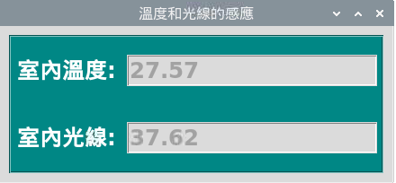

# 5.MCP3008

## MCP3008


## 線路圖


## 40pin


```python
import gpiozero as zero
from time import sleep

if __name__ == "__main__":
    mcp3008 = zero.MCP3008(7);
    while True:
        print("the channel 7 vlaue is {:.2f}".format(mcp3008.value));
        sleep(1);
```

## tkinter



```python
from tkinter import *
from gpiozero import MCP3008
from threading import Timer
import firebase_admin
from firebase_admin import credentials
from firebase_admin import db

class App:
    def __init__(self,master):
        #initial firebase
        cred = credentials.Certificate('raspberryfirebase-firebase-adminsdk-q4ht6-7d3f9d2d5e.json');
        firebase_admin.initialize_app(cred, {'databaseURL': 'https://raspberryfirebase.firebaseio.com/'})
        self.mcp3008Ref = db.reference('raspberrypi/MCP3008')
        #gpiozero
        self.lightness = MCP3008(channel=7);
        self.temperature = MCP3008(channel=6);
        
        #tkinter
        self.temperatureText = StringVar();
        self.lightnessText = StringVar();
        
        mainFrame = Frame(master,relief=GROOVE, borderwidth=2);
        Label(mainFrame, text="室內溫度:").grid(row=0,column=0,sticky=E,padx=5,pady=20);
        Label(mainFrame, text="室內光線:").grid(row=1,column=0,sticky=E,padx=5,pady=20);
        Entry(mainFrame, width = 16, textvariable=self.temperatureText,state = DISABLED).grid(row=0,column=1,sticky=W,padx=5,pady=20);
        self.temperatureText.set("123.456");
        Entry(mainFrame, width = 16, textvariable=self.lightnessText, state = DISABLED).grid(row=1,column=1,sticky=W,padx=5,pady=20);
        self.lightnessText.set("456.789");
        mainFrame.pack(padx=10,pady=10);
        
        self.autoUpdate();
        
    def autoUpdate(self):
        lightnessValue = self.lightness.value * 1000;
        temperatureValue = self.temperature.value * 3.3 * 100;
        self.temperatureText.set("{:.2f}".format(temperatureValue));
        self.lightnessText.set("{:.2f}".format(lightnessValue));
        try:
            self.mcp3008Ref.update({
                'brightness':lightnessValue,
                'temperature':temperatureValue
                });
        except:
            pass;
        
        
        Timer(1,self.autoUpdate).start();
        

if __name__ == "__main__":
    window = Tk();
    window.title("溫度和光線的感應");
    window.option_add("*font",("verdana",18,"bold"));
    window.option_add("*background", "#068587");
    window.option_add("*foreground", "#FFFFFF");
    #window.geometry("300x200");
    display = App(window);
    window.mainloop();
    
```

## tkinter and firebase db

```python
from tkinter import *
from gpiozero import MCP3008
from threading import Timer
import firebase_admin
from firebase_admin import credentials
from firebase_admin import db

class App:
    def __init__(self,master):
        #initial firebase
        cred = credentials.Certificate('raspberryfirebase-firebase-adminsdk-q4ht6-7d3f9d2d5e.json');
        firebase_admin.initialize_app(cred, {'databaseURL': 'https://raspberryfirebase.firebaseio.com/'})
        self.mcp3008Ref = db.reference('raspberrypi/MCP3008')
        #gpiozero
        self.lightness = MCP3008(channel=7);
        self.temperature = MCP3008(channel=6);
        
        #tkinter
        self.temperatureText = StringVar();
        self.lightnessText = StringVar();
        
        mainFrame = Frame(master,relief=GROOVE, borderwidth=2);
        Label(mainFrame, text="室內溫度:").grid(row=0,column=0,sticky=E,padx=5,pady=20);
        Label(mainFrame, text="室內光線:").grid(row=1,column=0,sticky=E,padx=5,pady=20);
        Entry(mainFrame, width = 16, textvariable=self.temperatureText,state = DISABLED).grid(row=0,column=1,sticky=W,padx=5,pady=20);
        self.temperatureText.set("123.456");
        Entry(mainFrame, width = 16, textvariable=self.lightnessText, state = DISABLED).grid(row=1,column=1,sticky=W,padx=5,pady=20);
        self.lightnessText.set("456.789");
        mainFrame.pack(padx=10,pady=10);
        
        self.autoUpdate();
        
    def autoUpdate(self):
        lightnessValue = self.lightness.value * 1000;
        temperatureValue = self.temperature.value * 3.3 * 100;
        self.temperatureText.set("{:.2f}".format(temperatureValue));
        self.lightnessText.set("{:.2f}".format(lightnessValue));
        try:
            self.mcp3008Ref.update({
                'brightness':lightnessValue,
                'temperature':temperatureValue
                });
        except:
            pass;
        
        
        Timer(1,self.autoUpdate).start();
        

if __name__ == "__main__":
    window = Tk();
    window.title("溫度和光線的感應");
    window.option_add("*font",("verdana",18,"bold"));
    window.option_add("*background", "#068587");
    window.option_add("*foreground", "#FFFFFF");
    #window.geometry("300x200");
    display = App(window);
    window.mainloop();
    
```

```python
from tkinter import *;
from gpiozero import MCP3008;
from gpiozero import DistanceSensor;
from gpiozero import AngularServo;
from threading import Timer;
import firebase_admin
from firebase_admin import credentials
from firebase_admin import db

cred = credentials.Certificate('raspberryfirebase-firebase-adminsdk-q4ht6-7d3f9d2d5e.json')
firebase_admin.initialize_app(cred,{
    'databaseURL': 'https://raspberryfirebase.firebaseio.com/'
    })
vrRef= db.reference('raspberrypi/vr');
disRef = db.reference('raspberrypi/dis');
print(vrRef.get());
class App:
    def __init__(self,window):
        self.vrText = StringVar();
        self.distanceValue = IntVar();
        self.gpioInit();
        mainFrame = Frame(window,borderwidth=2,relief=GROOVE);
        Label(mainFrame, text="可變電阻的值:").grid(row=0,column=0,padx=5,pady=20);
        Entry(mainFrame,width=16,state=DISABLED,textvariable=self.vrText).grid(row=0,column=1,padx=5,pady=20);
        
        Label(mainFrame, text="超音波距離:").grid(row=1,column=0,padx=5,pady=20);
        Entry(mainFrame,width=16,state=DISABLED,textvariable=self.distanceValue).grid(row=1,column=1,padx=5,pady=20);
        mainFrame.pack(padx=30,pady=30);
    
    def gpioInit(self):
        self.vrChannel = MCP3008(channel=7);
        self.distanceSensor = DistanceSensor(23, 24);
        self.servo = AngularServo(18,min_angle=-45,max_angle=45);
        self.servo.angle = 0.0;
        
        Timer(1,self.gpioAutoUpdate).start();
        
    def gpioAutoUpdate(self):
        #print("pot={}".format(self.vrChannel.value));
        vrValue = round(self.vrChannel.value,2);
        vrRef.set(vrValue);
        self.vrText.set("{:.0f}".format(self.vrChannel.value*100)) ;
        distanceValue = round(self.distanceSensor.distance*100,0);
        disRef.set(distanceValue);
        self.distanceValue.set(distanceValue);
        Timer(1,self.gpioAutoUpdate).start();
        
       

if __name__ == "__main__":
    window = Tk();
    window.title("MCP3008");
    window.option_add("*font",("verdana",18,"bold"));
    window.option_add("*background","#068587");
    window.option_add("*foreground", "#ffffff");
    root = App(window);
    window.mainloop();
```

```python
#!/usr/bin/python3.7
'''
MCP3008 , 可變電阻, pwmLed
程式重點
1程式每0.2秒會執行一次method
2.只有可變電阻值改變時才會執行程式
3.值快速連續改變非常多次時，只執行最後一次，這樣就可以最後一次才update firebase內的資料，而不是快速連續多次的更新
'''

from gpiozero import MCP3008
from tkinter import *
from threading import Timer
from gpiozero import PWMLED
import firebase_admin
from firebase_admin import credentials
from firebase_admin import db


channel0 = MCP3008(0)
led = PWMLED(18)

class App():
    def __init__(self,win):
        #firebase realtimedataBase_PWM
        self.master = win
        self.job = None
        self.outputValue = 0
        cred = credentials.Certificate('/home/pi/Documents/certificate/raspberryfirebase-firebase-adminsdk-y4f0x-cf4be2ca1a.json')
        firebase_admin.initialize_app(cred, {
            'databaseURL': 'https://raspberryfirebase.firebaseio.com/'
        })
        self.pwmRef = db.reference('iot20191126/PWM')
        print(self.pwmRef)
        #tkinter
        self.displayValue = IntVar()
        mainFrame = Frame(win,borderwidth=2,relief=GROOVE)
        displayBar = Scale(mainFrame, from_=0, to=100, orient=HORIZONTAL, variable=self.displayValue,length=300)
        displayBar.pack()
        mainFrame.pack()
        self.displayValue.set(50)
        self.auotUpdate()
        
    def userCreateJob(self):
        #這裏的寫法是連續快速執行時，只執行最後一次
        print("userCreateJob")
        if self.job:
            self.master.after_cancel(self.job);        
        self.job = self.master.after(500,self.firebaseDoSomeThing)
    
    def firebaseDoSomeThing(self):
        print('doSomethine')
        self.pwmRef.update({'value':self.displayValue.get()})

    def auotUpdate(self):
        #print('update')
        outputValue = int(channel0.value * 100)
        #只有先前的值有改變，才會執行if內的程式
        if self.outputValue != outputValue:
            self.outputValue = outputValue
            self.userCreateJob()
            
        led.value = channel0.value
        self.displayValue.set(outputValue)
        try:
            Timer(0.2,self.auotUpdate).start()
            #self.pwmRef.update({'value':outputValue})       
            
        except:
            print("error")
            Timer(0.2, self.auotUpdate).start()

if __name__ == '__main__':
    window = Tk()
    window.title("MCP3008_可變電阻")
    window.option_add("*font",('verdana',18,'bold'))
    window.option_add('*background','#333333')
    window.option_add('*foreground','#ffffff')
    app = App(window)
    window.mainloop()

```

