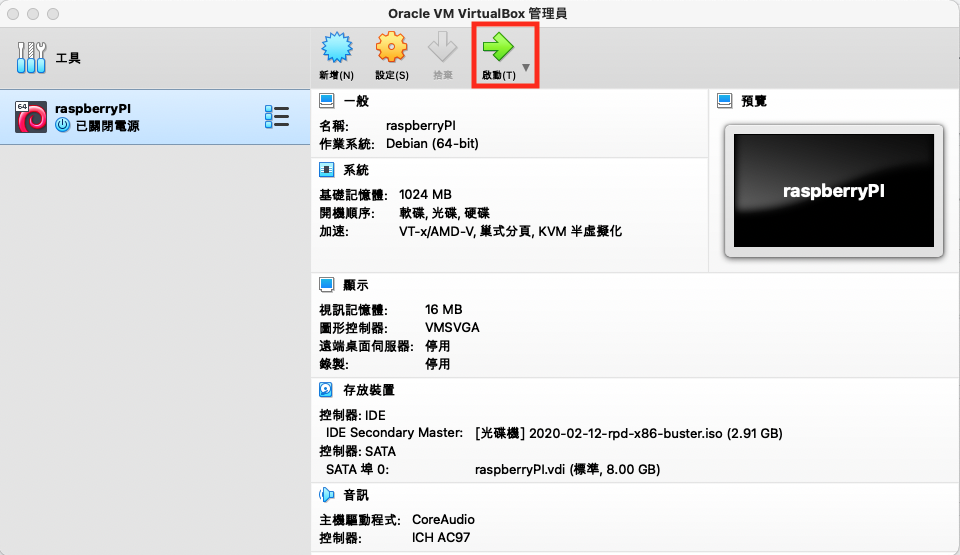
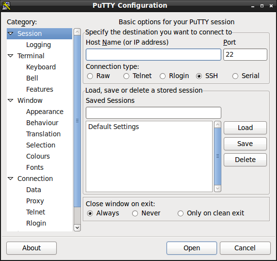
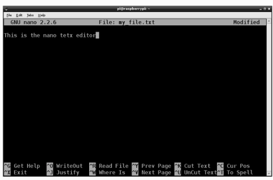
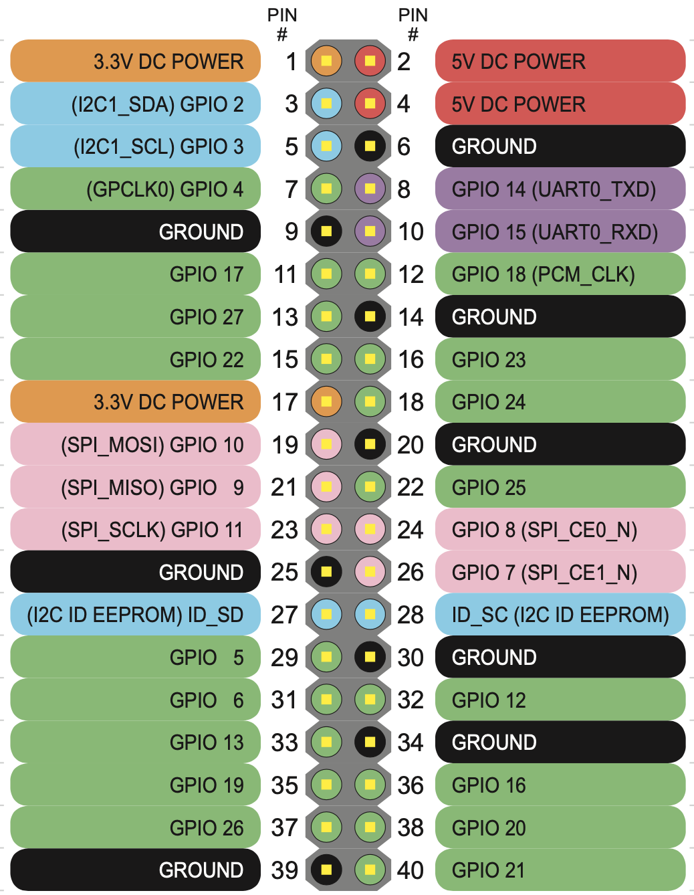
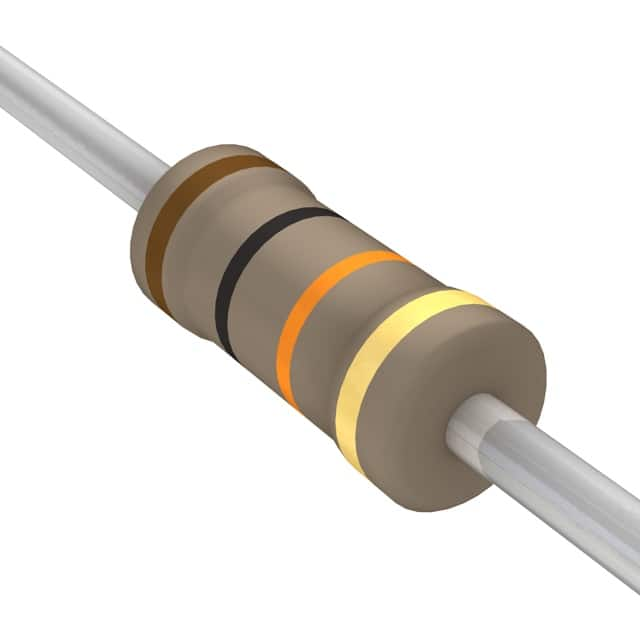
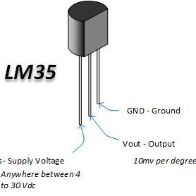
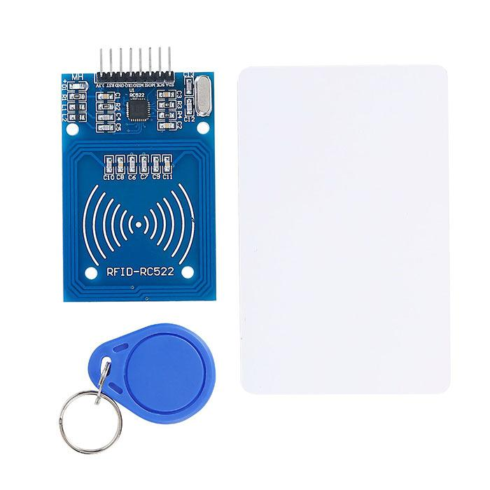

# Raspberry

預設帳號:pi

預設密碼:raspberry

# 目錄
- [沒有RaspberryPi硬體的解決方案](#noRaspberry)
- [下載Raspberry Pi OS](#download_Raspberry_Pi_OS)
- [從序列埠連線至Raspberry(必需要有TTL線)](https://www.raspberrypi.com.tw/tag/usb-to-ttl/)  
- [查詢Raspberry的 ip Address](#find_ip_address)  
- [PC 透過SSH連線至Raspberry](#sshToRaspberryOnPC)  
- [Mac 透過SSH連線至Raspberry](#sshToRaspberryOnMac)  
- [使用遠端桌面(Microsoft Remote Desktop)](#Microsoft_Remote_Desktop)  
- [建立github SSH keys](#create_SSH_KEYS)
- [使用SSH學習命令列](#command_line_interface)  
- [安裝vim文字編輯器](#install_vim)
- [安裝python3.x](#install_python)
- [安裝condamini和jupyter](#安裝condamini和jupyter)
- [使用Conda建立python的虛擬環境](#使用Conda建立python的虛擬環境)
- [安裝pycharm comunity editor for respberry4 2GB 以上](#install_pycharm)
- [安裝vscode](#install_vscode)
- [Raspberry的40pin](#Raspberry的40pin)
- [硬體一覽表](#sensor)
- [tkinter](./tkinter)
- [1.led Control](./Firebase_GPIO_tkinter/1LEDControl)
- [2.PWM LED](./Firebase_GPIO_tkinter/2PWMLed)
- [3.RGB LED](./Firebase_GPIO_tkinter/3RGBLed)
- [4.Button RGBLED](./Firebase_GPIO_tkinter/4Button_RGBLED)
- [5.MCP3008 光敏電阻 LM35](./Firebase_GPIO_tkinter/5MCP3008)
- [6.Servo](./Firebase_GPIO_tkinter/6servo)
- [7.7段顯示器](./Firebase_GPIO_tkinter/7seven_segment_display)
- [8.LCD_RFID](./Firebase_GPIO_tkinter/8LCD_RFID)
- [自動執行程式](#autoRunProgram)  
- [Blynk](./Blynk/LEDControl)
- [ifttt](./ifttt/)

<a name="noRaspberry"></a>
## 沒有RaspberryPi硬體的解決方案
- PC電腦下載[VMWare workstation player](https://www.vmware.com/tw/products/workstation-player.html)
- Mac電腦下載[VMWare Fution個人免費版](https://www.vmware.com/tw/products/fusion/fusion-evaluation.html)
- 下載[VirtualBox](https://www.virtualbox.org/)
- 下載[下載Raspberry Pi Desktop for PC and Mac](https://www.raspberrypi.org/software/raspberry-pi-desktop/)
- 安裝Raspberry Pi Desktop on VirtualBox步驟:
	- virtualBox管理員的新增
	
	
	
	- 建立名稱和作業系統
		- 名稱:raspberryPi
		- 機器資料夾:文件/raspberryVM
		- 類型:Linux
		- 版本:Debian(64-bin)
	
	
	
		- 記憶體大小-使用預設(1024MB)
		- 硬碟-使用預設(立即建立虛擬硬碟)
		- 硬碟檔類型-使用預設(VDI)
		- 存放裝置在實體硬碟-使用預設(動態分配)
		- 檔案位置和大小-使用預設
		
	- 選取設定
	
	 
	
	
	
	- 選取存放裝置->空的-> 選取下載的映像檔

	
	
	- 選取啟動



		

<a name="download_Raspberry_Pi_OS"></a>
## 下載Raspberry Pi OS

- 準備16G class10 的SD卡，並將插入至SD讀卡機內

1. 方法1(官方安裝安裝):  
	 - [安裝window或macOS的安裝檔](https://www.raspberrypi.org/software/)  
	 - 依步驟安裝  


2. 方法2(自行下載印像檔安裝):  
	-  [自官網下載Raspberry Pi OS with desktop and recommended software](https://www.raspberrypi.org/software/operating-systems/) 
	-  使用windows軟體[SDFormatter](https://www.sdcard.org/cht/downloads/formatter/),格式化sd卡  
	-  使用windows軟體[win32DiskImager](https://sourceforge.net/projects/win32diskimager/),將img檔燒錄到sd卡內 


<a name="find_ip_address"></a>
## 查詢Raspberry的 ip Address
1. 將raspberry連接電源線,螢幕,keyboard,mouse,並開啟手機熱點連線
2. 將raspberry連線至手機熱點


3. 開啟terminal,並查詢ip address

	`$ ifconfig`
	
	


<a name="sshToRaspberryOnPC"></a>
## PC 透過SSH連線到Raspberry
1. 下載並開啟[putty](https://www.chiark.greenend.org.uk/~sgtatham/putty/latest.html)
2. 開啟putty,並用ssh連線到raspberry




<a name="sshToRaspberryOnMac"></a>
## Mac 透過SSH連線至Raspberry

```
#開啟terminal
% ssh 帳號@raspberry_ip_address
```


## 透過SSH設定raspberry環境
1. 開啟raspberry環境設定

	$ sudo raspi-config


2.選擇 Interfacing Options
	- VNC關閉，其餘開啟


3.選擇 Localisation Options -> 選擇Change Locale -> 選擇zh-TW.UTF8


4.選擇 Localisation Options -> 選擇Timezone -> 選擇Asia 

 

5.選擇 Localisation Options -> 選擇Change Wi-fi Country -> 選擇TW


6.選擇 Localisation Options -> 選擇Keyboard Layout
	- Model:105-key PC(intl.)
	- Layout:English(UK)
	- Variant:English(UK) 

<a name="Microsoft_Remote_Desktop"></a>
### 使用遠端桌面(Microsoft Remote Desktop)
1. 關閉 vnc Server
2. 透過ssh安裝xrdp

	`sudo apt-get update`
	`sudo apt-get install xrdp -y`

3.使用遠端桌面連線raspberry


<a name="create_SSH_KEYS"></a>
### 建立github SSH keys
1. 在/home/pi建立目錄 .ssh

	`cd ~`
	
2. 建立.shh目錄

	`mkdir .ssh`
	
3. 進入目錄

	`cd .ssh`
	
4. 建立金鑰

	`ssh-keygen`
	
5. 使用vim copy金鑰內容，並貼上至gitHub內

	`vim id_rsa.pub`
	

<a name="command_line_interface"></a>
## 使用SSH學習命令列
### 導覽檔案系統
```
#使用者目錄(/home/pi)
pi@raspberrypi: ~ $
```

```
#查看當前所在目錄(print working directory)
pi@raspberrypi: ~ $ pwd
/home/pi
```

```
#回到上層目錄
$ cd ..
$ pwd
/home
```

```
#絕對路徑(/xxxx/xxxxx/xxxx)
#相對路徑(./xxxx/xxxx/xxx)
```

```
#回到電腦根目錄
$ cd /
$ pwd
/
```

```
#回到使用者目錄
$ cd ~
```


```
#檢查目前目錄內容
$ ls
$ ls -l
$ ls -al
```

### 複製檔案或資料夾
```
#建立文字檔
$ echo "hello" > myfile.txt
$ ls
myfile.txt

#複製文字檔
$ cp myfile.txt myfile2.txt
$ ls
myfile.txt myfile2.txt

#複製文字檔至別的目錄
$ cp myfile.txt /tmp

#複製整個目錄和內容
$ cp -r mydirectory mydirectory2
```


### 重新命名檔案名稱或資料夾名稱

```
$ mv my_file.txt my_file.rtf
```

### 檢視檔案內容

```
$ cat myfile.txt
$ more myfile.txt
$ less myfile.txt
```

### 建立編輯檔案

```
$ touch my_file.txt
$ nano my_file.txt
```


### 建立目錄

```
$ cd ~
$ mkdir my_directory
$ cd my_directory
$ ls
```

### 刪除檔案或目錄

```
# 刪除檔案
$ cd ~
$ rm my_file.txt
$ ls

# 刪除同檔名但不同副檔名的檔案
$ rm my_file.*

# 刪除所有檔案
$ rm *

# 刪除目錄和內容
$ rm -r mydir
```

### 使用superuser執行任務

```
$ sudo xxxxxxxxxxx

# 保持sudo狀態
$ sudo sh

# 離開sudo狀態
$ exit
```

### 了解檔案權限


### 改變檔案權限

```
$ chmod u+x file2.txt
# u 代表user
# g 代表group
# o 代表other

# + 代表增加權限
# - 代表移除權限

# x 代表可執行的權利

```

### 改變擁有者

```
#更改檔案
$ sudo chown root:root <檔案名稱>

# root:root - user:group

#更改目錄
$ sudo chown -R root:root <目錄名>
```

### 使用apt-get安裝和移除軟體

```
# 更新 apt-get套件管理的軟體清單
$ sudo apt-get update
```

```
# 檢查是否清單有此軟體
$ sudo apt-get search <軟體名稱>
```

```
# 安裝軟體
$ sudo apt-get install <軟體名稱>
```

```
# 移除軟體
$ sudo apt-get remove <軟體名稱>

# 移除軟體和相關的附屬軟體

$ sudo apt-get autoremove <軟體名稱>
```


<a name="install_vim"></a>
## 安裝vim文字編輯器

```
>>> sudo apt-get install vim
```

### 切換模式
Vim 主要是使用模式的切換來進行輸入、移動游標、選取、複製及貼上等操作。在 Vim 主要常用的有幾個模式:Normal 模式以及 Insert 模式:


1. Normal模式，又稱命令模式，在這個模式下，無法輸入文字，僅能進行複製、貼上、存 檔或離開動作。
2. 要開始輸入文字，需要先按下 i 、 a 或 o 這三個鍵其中一個進入 Insert 模式，便能 開始打字。其中， i 表示 insert ， a 表示 append ，而 o 則是表示會新增一行並開 始輸入。
3. 在 Insert 模式下，按下 ESC 鍵或是 Ctrl + [ 組合鍵，可退回至 Normal 模式。
4. 在 Normal 模式下，按下 :w 會進行存檔，按下 :q 會關閉這個檔案(但若未存檔會提
示先存檔再離開)，而 :wq 則是存檔完成後直接關閉這個檔案。


<a name="install_python"></a>
## 安裝python 3.x

### 檢查目前預設python,python3版本
`$ python --version`

`$ python3 --version`

### 檢查執行那一個python
`$ which python`

`$ which python3`

### 安裝python3

```
$ sudo apt update
$ sudo apt install python3
```


<a name=“install_python”></a>
## 安裝python

```
#檢查python版本
$ python —version

#目前python的路徑
$ which python

#安裝python3
$ sudo apt-get inatll python3

#更改環境設定
$ sudo vim ~/.bashrc
# 在最後一行加上
export PATH=“/usr/bin:$PATH”
```


<a name="安裝condamini和jupyter"></a>
## 安裝miniconda和jupyter

### 步驟 1:下載miniconda
	$ wget http://repo.continuum.io/miniconda/Miniconda3-latest-Linux-armv7l.sh

### 步驟2:安裝miniconda
一開始會出現License ，一直按enter會出現問你是否同意Licence，輸入yes。

會問你要安裝在預設路徑 /root/minconda3，或其他地方。我是安裝到此處:
/home/pi/miniconda3

會問你要不要加入PATH，先輸入no，下步驟再加入PATH

	$ sudo /bin/bash Miniconda3-latest-Linux-armv7l.sh
	
### 步驟3:設定PATH

	$ sudo nano /home/pi/.bashrc

在檔案最尾端加入下方文字後存檔

	export PATH=”/home/pi/miniconda3/bin:$PATH”
	
重新執行.bashrc

	$ source ~/.bashrc
	
步驟4:更改miniconda3下的所有檔案及目錄，為pi的擁有者

	$ sudo chown -R pi miniconda3
	
步驟 5:安裝python，會問是否同意安裝，按y

	#修改conda的預設檔,告知要使用的硬體是rpi
	conda config —add channels rpi
	
	#查詢conda提供的python版本 conda search "^python$"
	conda install python=3.6
	
步驟 6:安裝Jupyter notebook

	$ conda install jupyter
	
步驟 7:測試

	$ python -V
	$ which python
	
步驟 8:開啟jupyter

	$jupyter notebook
	
<a name="使用Conda建立python的虛擬環境"></a>
## 使用Conda建立python的虛擬環境
- 安裝numpy, pandas, matplotlib
- 安裝gpio套件

### 1.檢查conda版本
	$ conda -V
	conda 4.5.11
	
### 2.更新conda
	$ conda update conda
	
### 3.建立python虛擬環境
	#檢查conda提供的python版本
	$ conda search "^python$" 
	
	#建立一個虛擬環境env01, x.x為要安裝的版本
	$ conda create -n env01 python=x.x
	
### 4.啟動conda虛擬環境

	$ source activate env01

	#查看目前所有conda的虛擬環境
	conda info -e
	
### 5.使用conda安裝python package
	$ conda install -n env01 numpy
	$ conda install -n env01 pandas
	$ conda install -n env01 matplotlib
	
### 6.安裝gpio需要的套件

	(envo1)$ pip install RPI.GPIO
	(envo1)$ pip install gpiozero

### 7.離開conda的虛擬環境
	$source deactivate
	
### 8. 刪除虛擬環境
	$ conda remove -n env01 -all
	
<a name="install_pycharm"></a>
## 安裝pycharm comunity editor for respberry4 2GB 以上

## 更新jdp
```
$ sudo apt update
$ sudo apt install default-jdk
```
### 下載pycharm
```
https://www.jetbrains.com/pycharm/download/
```

## 安裝vscode
```
$ sudo su
$ . <( wget -O - https://code.headmelted.com/installers/apt.sh )
$ exit
```

### 解壓縮,並copy 至 /opt 目錄
```
sudo mv pycharm-community-2020.x.x /opt/pycharm-community-2020.x.x
```

### 執行pycharm.sh

```
./bin/pycharm.sh
```


<a name="Raspberry的40pin"></a>
## Raspberry的40pin


<a name="sensor"></a>
## 硬體一覽表
- 杜邦線(公-公, 公-母)


- 麵包板  


- T型接頭和排線  


- LED發光二極體


- RGB LED(共陰)


- 電阻220  


- 電阻10k  


- MCP3008


- 按鈕  


- 可變電阻3腳10k  


- LM35  


- 光敏電阻  


- SG90 9G伺服馬達


- I2C 1602 液晶模塊  


- 蜂鳴器(有源) 


- RFID 模組套件 RC522 FID 射頻IC卡感應模塊  


- raspberry 攝影機  (副廠有200多元的)


<a name=autoRunProgram></a>	
## 自動執行程式

### 啟動時自動執行應用程式

```
sudo nano /etc/rc.local

在最後一行加入
$ /usr/bin/python /home/pi/my_program.py &
```

	
