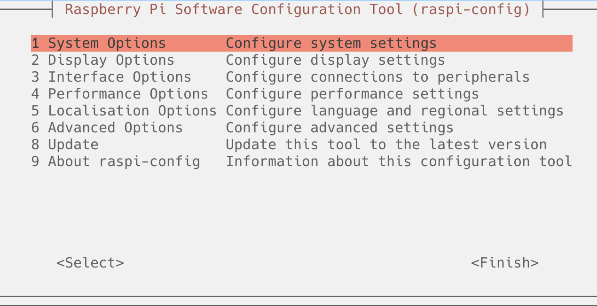
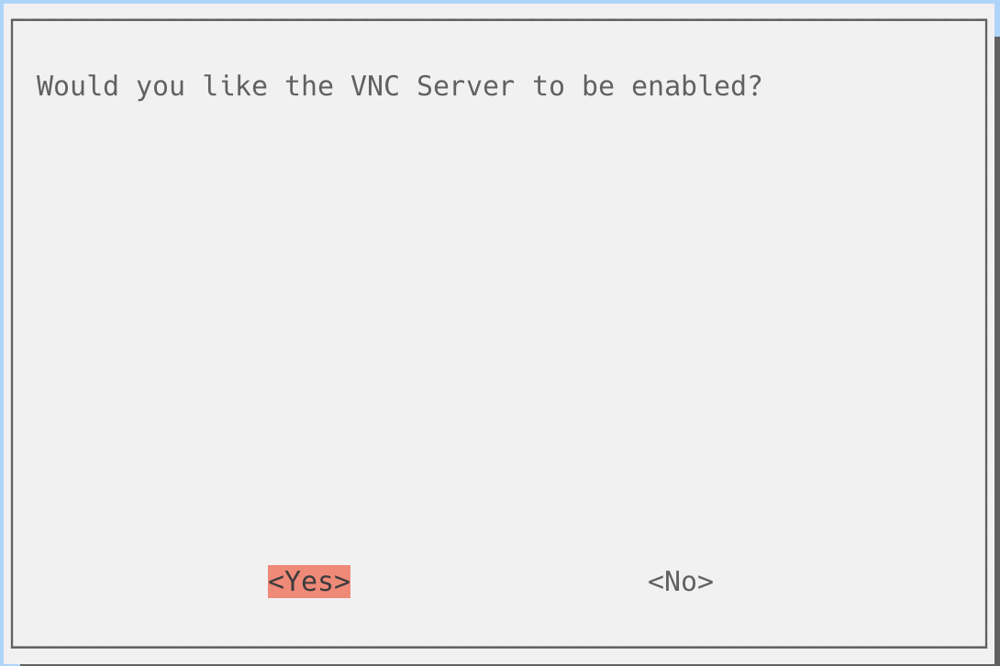
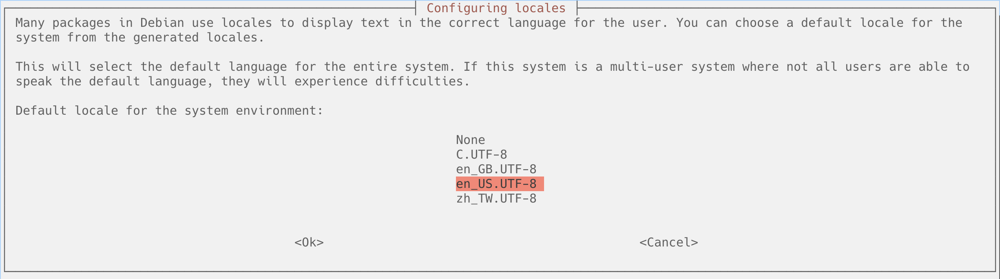
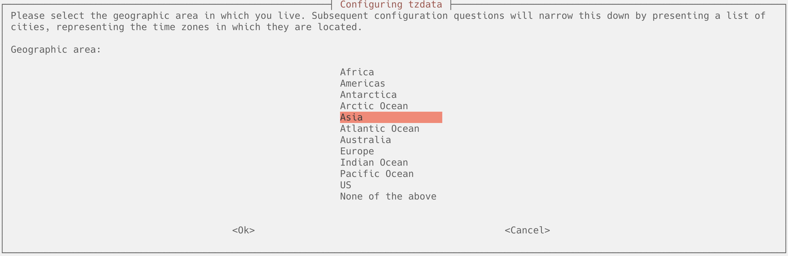
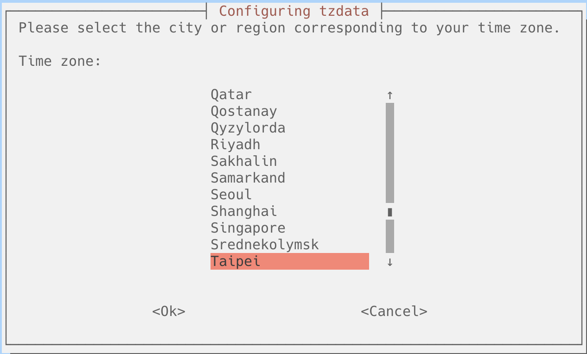
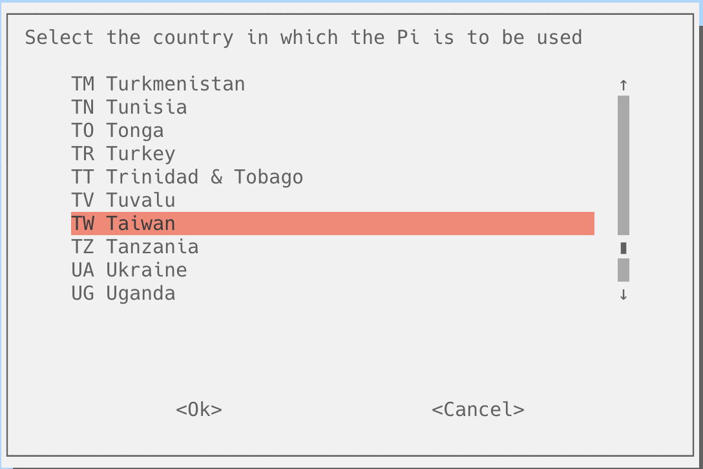

# 樹莓派的初始化設定

## 1. 透過SSH連線至Raspberry

```
#開啟terminal
ssh 帳號@raspberry_ip_address
#或都
ssh 帳號@主機名稱.local
```

## 2. 透過raspi-config進行基本初始化設定

### **2.1 ssh連線後,進入設定環境**

```bash
sudo raspi-config
```



### **2.2 打開vnc連線**
- 進入Interface Options -> VNC



### **2.3 語言字型下載和設定區域設定**
- 進入Localisation Options

#### **2.3.1 locale**
- 進入Locale


- **選擇要安裝的語言**
	- zh_TW.UTF-8 UTF-8
	- en_US.UTF-8 UTF-8

- **按下後選擇目前預設的語言是**
	- 預設請使用英文版 en_US.UTF-8



#### **2.3.2選擇時區Timezone**
- 進入Timezone
- 選擇Asia



- 再選取Taipei



#### **2.3.3選擇wifi國家**
- WLAN
- 選擇TW Taiwan



### **2.4 更新軟體Update**
- Update

### **重新開機**

```
sudo reboot
```


