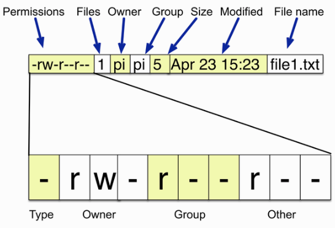
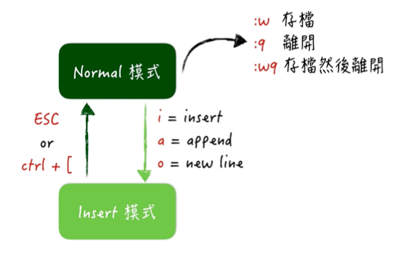

# 命令列
- [使用SSH學習命令列](#command_line_interface)  
- [使用apt-get安裝和移除軟體](#apt_get)
- [安裝vim文字編輯器](#install_vim)

<a name="command_line_interface"></a>
## 1. 使用SSH學習命令列
### 1.1 導覽檔案系統

```
#使用者目錄(/home/pi)
pi@raspberrypi: ~ $
```

```
#查看當前所在目錄(print working directory)
pi@raspberrypi: ~ $ pwd
/home/pi
```

```
#回到上層目錄
$ cd ..
$ pwd
/home
```

```
#絕對路徑(/xxxx/xxxxx/xxxx)
#相對路徑(./xxxx/xxxx/xxx)
```

```
#回到電腦根目錄
$ cd /
$ pwd
/
```

```
#回到使用者目錄
$ cd ~
```


```
#檢查目前目錄內容
$ ls
$ ls -l
$ ls -al
```

### 1.2 複製檔案或資料夾

```
#建立文字檔
$ echo "hello" > myfile.txt
$ ls
myfile.txt

#複製文字檔
$ cp myfile.txt myfile2.txt
$ ls
myfile.txt myfile2.txt

#複製文字檔至別的目錄
$ cp myfile.txt /tmp

#複製整個目錄和內容
$ cp -r mydirectory mydirectory2
```


### 1.3 重新命名檔案名稱或資料夾名稱

```
$ mv my_file.txt my_file.rtf
```

### 1.4 檢視檔案內容

```
$ cat myfile.txt
$ more myfile.txt
$ less myfile.txt
```

### 1.5 建立編輯檔案

```
$ touch my_file.txt
$ nano my_file.txt
```


### 1.6 建立目錄

```
$ cd ~
$ mkdir my_directory
$ cd my_directory
$ ls
```

### 1.7 刪除檔案或目錄

```
# 刪除檔案
$ cd ~
$ rm my_file.txt
$ ls

# 刪除同檔名但不同副檔名的檔案
$ rm my_file.*

# 刪除所有檔案
$ rm *

# 刪除目錄和內容
$ rm -r mydir
```

### 1.8 使用superuser執行任務

```
$ sudo xxxxxxxxxxx

# 保持sudo狀態
$ sudo sh

# 離開sudo狀態
$ exit
```

### 1.9 了解檔案權限



#### 1.9.1 改變檔案權限

```
$ chmod u+x file2.txt
# u 代表user
# g 代表group
# o 代表other

# + 代表增加權限
# - 代表移除權限

# x 代表可執行的權利

```

### 1.9.2 改變擁有者

```
#更改檔案
$ sudo chown root:root <檔案名稱>

# root:root - user:group

#更改目錄
$ sudo chown -R root:root <目錄名>
```

<a name="apt_get"></a>
## 2. 使用apt-get安裝和移除軟體

```
# 更新 apt-get套件管理的軟體清單
$ sudo apt-get update
```

```
# 檢查是否清單有此軟體
$ sudo apt-get search <軟體名稱>
```

```
# 安裝軟體
$ sudo apt-get install <軟體名稱>
```

```
# 移除軟體
$ sudo apt-get remove <軟體名稱>

# 移除軟體和相關的附屬軟體

$ sudo apt-get autoremove <軟體名稱>
```


<a name="install_vim"></a>
##  3. 安裝vim文字編輯器

```
>>> sudo apt-get install vim
```

### 3.1 切換模式
Vim 主要是使用模式的切換來進行輸入、移動游標、選取、複製及貼上等操作。在 Vim 主要常用的有幾個模式:Normal 模式以及 Insert 模式:



1. Normal模式，又稱命令模式，在這個模式下，無法輸入文字，僅能進行複製、貼上、存 檔或離開動作。
2. 要開始輸入文字，需要先按下 i 、 a 或 o 這三個鍵其中一個進入 Insert 模式，便能 開始打字。其中， i 表示 insert ， a 表示 append ，而 o 則是表示會新增一行並開 始輸入。
3. 在 Insert 模式下，按下 ESC 鍵或是 Ctrl + [ 組合鍵，可退回至 Normal 模式。
4. 在 Normal 模式下，按下 :w 會進行存檔，按下 :q 會關閉這個檔案(但若未存檔會提
示先存檔再離開)，而 :wq 則是存檔完成後直接關閉這個檔案。

### 3.2 暫時離開

1. 暫時離開 `ctrl + z`

2. 回至vim `fg`

### 3.3 使用`h`,`j`,`k`,`l`移動游標

- `h` -> 向左移動
- `j` -> 向下移動
- `k` -> 向上移動
- `l` -> 向右移動

[vim adventure練習網站](./https://vim-adventures.com/)

### 3.4 使用`w`,`W`,`b`,`B`,`}`,`{`,`]]`,`[[`,`0`,`$`

- `w` -> 向下一個字移動
- `W` -> 向下一個字移動,跳過標點符號
- `b` -> 向上一個字移動
- `B` -> 向上一個字移動,跳過標點符號
- `}` -> 跳下一個段落
- `{` -> 跳上一個段落
- `]]`,`G`-> 文件最後
- `[[`,`gg` -> 文件最前
- `0` -> 移到行首
- `$` -> 移到行尾

> w -> word
>
> b -b back

