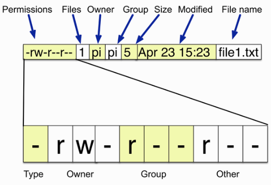
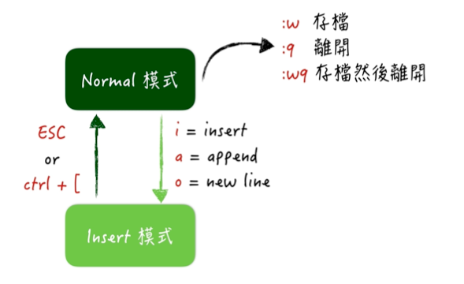

# 命令列
- [使用SSH學習命令列](#command_line_interface)  
- [使用apt-get安裝和移除軟體](#apt_get)
- [安裝vim文字編輯器](#install_vim)

<a name="command_line_interface"></a>
## 1. 使用SSH學習命令列
### 1.1 導覽檔案系統

```
#使用者目錄(/home/pi)
pi@raspberrypi: ~ $
```

```
#查看當前所在目錄(print working directory)
pi@raspberrypi: ~ $ pwd
/home/pi
```

```
#回到上層目錄
$ cd ..
$ pwd
/home
```

```
#絕對路徑(/xxxx/xxxxx/xxxx)
#相對路徑(./xxxx/xxxx/xxx)
```

```
#回到電腦根目錄
$ cd /
$ pwd
/
```

```
#回到使用者目錄
$ cd ~
```


```
#檢查目前目錄內容
$ ls
$ ls -l
$ ls -al
```

### 1.2 複製檔案或資料夾

```
#建立文字檔
$ echo "hello" > myfile.txt
$ ls
myfile.txt

#複製文字檔
$ cp myfile.txt myfile2.txt
$ ls
myfile.txt myfile2.txt

#複製文字檔至別的目錄
$ cp myfile.txt /tmp

#複製整個目錄和內容
$ cp -r mydirectory mydirectory2
```


### 1.3 重新命名檔案名稱或資料夾名稱

```
$ mv my_file.txt my_file.rtf
```

### 1.4 檢視檔案內容

```
$ cat myfile.txt
$ more myfile.txt
$ less myfile.txt
```

### 1.5 建立編輯檔案

```
$ touch my_file.txt
$ nano my_file.txt
```


### 1.6 建立目錄

```
$ cd ~
$ mkdir my_directory
$ cd my_directory
$ ls
```

### 1.7 刪除檔案或目錄

```
# 刪除檔案
$ cd ~
$ rm my_file.txt
$ ls

# 刪除同檔名但不同副檔名的檔案
$ rm my_file.*

# 刪除所有檔案
$ rm *

# 刪除目錄和內容
$ rm -r mydir
```

### 1.8 搜尋檔案和內容

#### 1.8.1 使用find搜尋檔案

```bash
# 在當前目錄搜尋檔案名稱
$ find . -name "*.txt"

# 在指定目錄搜尋檔案
$ find /home/pi -name "myfile.txt"

# 搜尋特定類型的檔案
$ find . -type f -name "*.py"  # 搜尋Python檔案
$ find . -type d -name "my*"   # 搜尋目錄

# 按檔案大小搜尋
$ find . -size +10M            # 大於10MB的檔案
$ find . -size -1M             # 小於1MB的檔案

# 按修改時間搜尋
$ find . -mtime -7             # 7天內修改的檔案
$ find . -mtime +30            # 30天前修改的檔案
```

#### 1.8.2 使用grep搜尋檔案內容

```bash
# 在檔案中搜尋文字
$ grep "hello" myfile.txt

# 在多個檔案中搜尋
$ grep "hello" *.txt

# 遞迴搜尋目錄中的所有檔案
$ grep -r "hello" /home/pi/

# 忽略大小寫搜尋
$ grep -i "Hello" myfile.txt

# 顯示行號
$ grep -n "hello" myfile.txt

# 搜尋不包含特定文字的行
$ grep -v "hello" myfile.txt

# 使用正規表達式
$ grep "^hello" myfile.txt     # 以hello開頭的行
$ grep "world$" myfile.txt     # 以world結尾的行
```

#### 1.8.3 使用locate快速搜尋

```bash
# 更新locate資料庫
$ sudo updatedb

# 快速搜尋檔案
$ locate myfile.txt

# 限制搜尋結果數量
$ locate -l 5 "*.py"
```

#### 1.8.4 使用which和whereis

```bash
# 找出命令的位置
$ which python3
$ which vim

# 找出程式的位置、原始碼和說明文件
$ whereis python3
```


### 1.9 檔案壓縮和解壓縮

```bash
# 建立tar壓縮檔
$ tar -czf backup.tar.gz mydirectory/

# 解壓縮tar檔案
$ tar -xzf backup.tar.gz

# 建立zip壓縮檔
$ zip -r backup.zip mydirectory/

# 解壓縮zip檔案
$ unzip backup.zip

# 查看壓縮檔內容
$ tar -tzf backup.tar.gz
$ unzip -l backup.zip
```

### 1.10 檔案連結

```bash
# 建立硬連結
$ ln myfile.txt hardlink.txt

# 建立軟連結(符號連結)
$ ln -s /path/to/original/file symlink.txt

# 查看連結資訊
$ ls -l
```

### 1.11 檔案比較

```bash
# 比較兩個檔案的差異
$ diff file1.txt file2.txt

# 並排顯示差異
$ diff -y file1.txt file2.txt

# 比較目錄
$ diff -r dir1/ dir2/
```

### 1.12 監控檔案變化

```bash
# 即時顯示檔案末尾內容
$ tail -f /var/log/syslog

# 顯示檔案最後10行
$ tail myfile.txt

# 顯示檔案前10行
$ head myfile.txt

# 監控檔案變化
$ watch -n 1 'ls -l'  # 每秒更新一次
```

### 1.13 檔案統計資訊

```bash
# 計算檔案行數、字數、字元數
$ wc myfile.txt
$ wc -l myfile.txt  # 只顯示行數
$ wc -w myfile.txt  # 只顯示字數

# 查看檔案大小
$ du -h myfile.txt
$ du -sh mydirectory/  # 查看目錄大小

# 查看磁碟使用情況
$ df -h
```

### 1.14 使用superuser執行任務

```
$ sudo xxxxxxxxxxx

# 保持sudo狀態
$ sudo sh

# 離開sudo狀態
$ exit
```

### 1.15 了解檔案權限



#### 1.15.1 改變檔案權限

```
$ chmod u+x file2.txt
# u 代表user
# g 代表group
# o 代表other

# + 代表增加權限
# - 代表移除權限

# x 代表可執行的權利

```

#### 1.15.2 數字權限表示法

```bash
# 使用數字設定權限
$ chmod 755 myfile.txt
# 7 = 4+2+1 (rwx) owner權限
# 5 = 4+1 (r-x) group權限  
# 5 = 4+1 (r-x) other權限

# 常用權限組合
$ chmod 644 myfile.txt  # rw-r--r--
$ chmod 755 myscript.sh # rwxr-xr-x
$ chmod 600 private.txt # rw-------
```

#### 1.15.3 改變擁有者

```
#更改檔案
$ sudo chown root:root <檔案名稱>

# root:root - user:group

#更改目錄
$ sudo chown -R root:root <目錄名>
```

### 1.16 程序管理

```bash
# 查看正在執行的程序
$ ps aux
$ ps -ef

# 查看即時程序狀態
$ top
$ htop  # 需要安裝: sudo apt-get install htop

# 根據程序名稱搜尋
$ ps aux | grep python

# 終止程序
$ kill <PID>
$ killall <程序名稱>

# 強制終止程序
$ kill -9 <PID>

# 背景執行程序
$ python3 myscript.py &

# 查看背景工作
$ jobs

# 將背景工作帶到前景
$ fg %1
```

### 1.17 網路相關指令

```bash
# 測試網路連線
$ ping google.com
$ ping -c 4 8.8.8.8  # 只ping 4次

# 查看網路介面
$ ifconfig
$ ip addr show

# 下載檔案
$ wget https://example.com/file.txt
$ curl -O https://example.com/file.txt

# 查看網路連線狀態
$ netstat -tuln
$ ss -tuln
```

### 1.18 系統資訊

```bash
# 查看系統資訊
$ uname -a
$ lsb_release -a

# 查看CPU資訊
$ lscpu
$ cat /proc/cpuinfo

# 查看記憶體使用情況
$ free -h

# 查看磁碟空間
$ df -h

# 查看系統負載
$ uptime

# 查看登入使用者
$ who
$ w
```

<a name="apt_get"></a>
## 2. 使用apt-get安裝和移除軟體

```
# 更新 apt-get套件管理的軟體清單
$ sudo apt-get update
```

```
# 檢查是否清單有此軟體
$ sudo apt-get search <軟體名稱>
```

```
# 安裝軟體
$ sudo apt-get install <軟體名稱>
```

```
# 移除軟體
$ sudo apt-get remove <軟體名稱>

# 移除軟體和相關的附屬軟體

$ sudo apt-get autoremove <軟體名稱>
```


<a name="install_vim"></a>
##  3. 安裝vim文字編輯器

```
>>> sudo apt-get install vim
```

### 3.1 切換模式
Vim 主要是使用模式的切換來進行輸入、移動游標、選取、複製及貼上等操作。在 Vim 主要常用的有幾個模式:Normal 模式以及 Insert 模式:



1. Normal模式，又稱命令模式，在這個模式下，無法輸入文字，僅能進行複製、貼上、存 檔或離開動作。
2. 要開始輸入文字，需要先按下 i 、 a 或 o 這三個鍵其中一個進入 Insert 模式，便能 開始打字。其中， i 表示 insert ， a 表示 append ，而 o 則是表示會新增一行並開 始輸入。
3. 在 Insert 模式下，按下 ESC 鍵或是 Ctrl + [ 組合鍵，可退回至 Normal 模式。
4. 在 Normal 模式下，按下 :w 會進行存檔，按下 :q 會關閉這個檔案(但若未存檔會提
示先存檔再離開)，而 :wq 則是存檔完成後直接關閉這個檔案。

### 3.2 暫時離開

1. 暫時離開 `ctrl + z`

2. 回至vim `fg`

### 3.3 一般模式下,使用`h`,`j`,`k`,`l`移動游標

- `h` -> 向左移動
- `j` -> 向下移動
- `k` -> 向上移動
- `l` -> 向右移動

[vim adventure練習網站](./https://vim-adventures.com/)

### 3.4 一般模式下,使用`w`,`W`,`b`,`B`,`}`,`{`,`]]`,`[[`,`0`,`$`

- `w` -> 向下一個字移動
- `W` -> 向下一個字移動,跳過標點符號
- `b` -> 向上一個字移動
- `B` -> 向上一個字移動,跳過標點符號
- `}` -> 跳下一個段落
- `{` -> 跳上一個段落
- `]]`,`G`-> 文件最後
- `[[`,`gg` -> 文件最前
- `0` -> 移到行首
- `$` -> 移到行尾

> w -> word
>
> b -b back

### 3.5 一般模式下搜尋文字,使用`/`

- `/` -> 搜尋

> `/搜尋文字` 然後按 `Enter`

- 搜尋後使用`n` -> 向下尋找搜尋結果
- 搜尋後使用`N` -> 向上尋找搜尋結果

- `:set hlsearch` -> 反白搜尋結果文字
- `:set nohlsearch` -> 取消反白

----

- `f` -> 單行向下搜尋
- `F` -> 單行向上搜尋
> 'fa` -> 跳至該行下一各文字a

---

- `zz` -> 將該行移至畫面中間
- `zt` -> 將該行移至畫面上方
- `zb` -> 將該行移至畫面下方

### 3.6 選取,複制,貼上,undo,Delete(Visual)
- `v` -> Visual 模式
- `V` -> Visual line模式,並選取一整行
- 先移動到目標文字(一般標式),再進入Visual模式
- `y` -> 複制(yank,儲存在register)
- `yy` -> 複制整行(不用進入Visual模式) |  `2yy` -> 複制2行
- `p`  -> 貼上
- `u` -> undo
- `ctrl+r` -> redo

### 3.7 編輯檔案內容
- `I` -> 跳至行首並進入insert模式
- `A` -> 跳側行未並進入insert模式
- `O` -> 在游標上方插入一行並進入insert模式
- `x` -> 刪除文字
- `d` -> 刪除文字(visual 模式)
- `D` -> 刪除此字至最後的文字.
- `dd` -> 刪除整行(一般模式)
- `2dd` -> 刪除2行
- `dG` -> 刪除此行到最後
- `dgg` -> 刪除些行到最前面
- `c` -> 刪除文字並進入至insert模式
- `C` -> 刪除此字至最後的文字,並進入insert模式
- `r` -> Replace
- `>>` -> indent
- `<<` -> indent back
- `:set shiftwidth=2` -> 設定indent的字數
- `:set tabstop=4` -> 設定tab的字數


