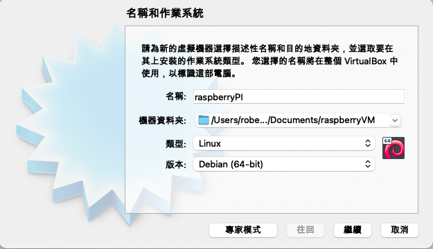
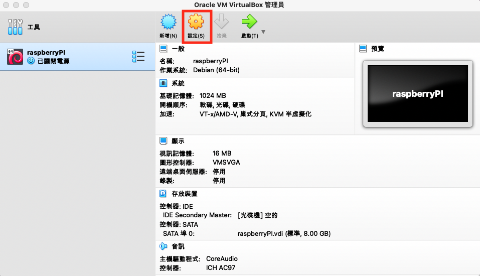
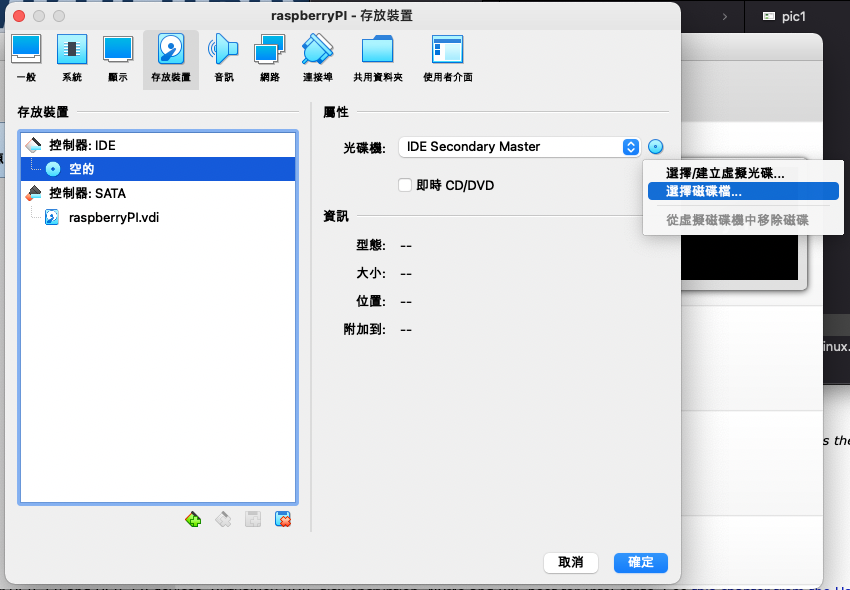
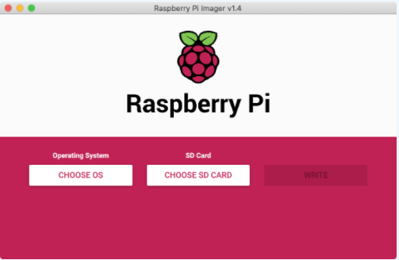
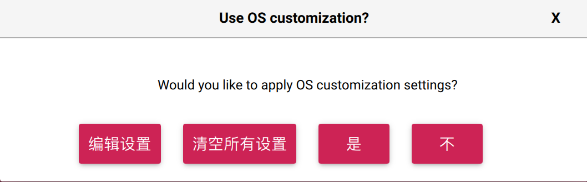
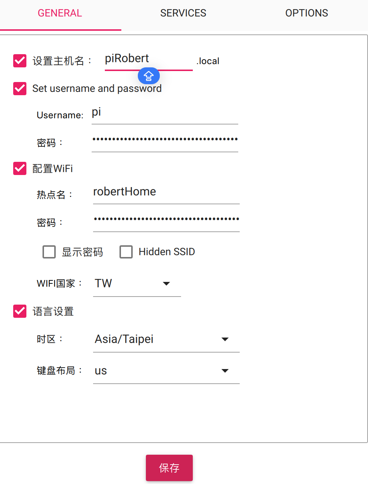
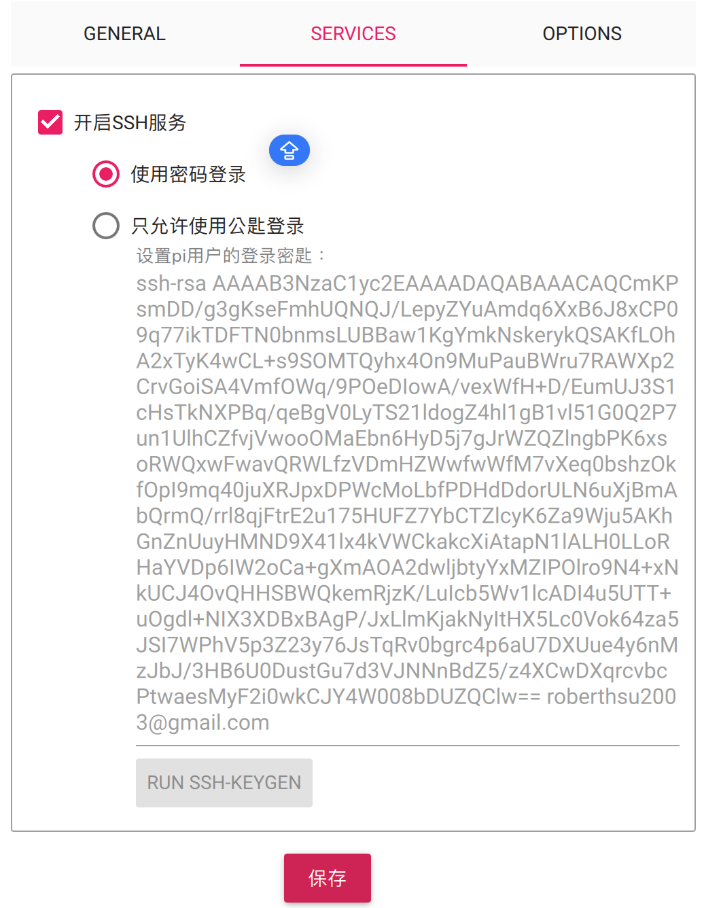

## 系統安裝
- [沒有RaspberryPi硬體的解決方案](#noRaspberry)
- [下載Raspberry Pi OS](#downloadRaspberryPiOS)

## 沒有RaspberryPi硬體的解決方案
- PC電腦下載[VMWare workstation player](https://www.vmware.com/tw/products/workstation-player.html)
- [raspberryOS_install](https://youtube.com/live/skJ3XT_R-1A?feature=share)

- Mac電腦下載[VMWare Fution個人免費版](https://www.vmware.com/tw/products/fusion/fusion-evaluation.html)
- [VMWare workstation player 安裝方式](https://thesecmaster.com/install-raspberry-pi-os-on-vmware-workstation/)

- 下載[VirtualBox](https://www.virtualbox.org/)
- 下載[下載Raspberry Pi Desktop for PC and Mac](https://www.raspberrypi.org/software/raspberry-pi-desktop/)
- 安裝Raspberry Pi Desktop on VirtualBox步驟:
	- virtualBox管理員的新增
	
	
	
	- 建立名稱和作業系統
		- 名稱:raspberryPi
		- 機器資料夾:文件/raspberryVM
		- 類型:Linux
		- 版本:Debian(64-bin)
	
	
	
		- 記憶體大小-使用預設(1024MB)
		- 硬碟-使用預設(立即建立虛擬硬碟)
		- 硬碟檔類型-使用預設(VDI)
		- 存放裝置在實體硬碟-使用預設(動態分配)
		- 檔案位置和大小-使用預設
		
	- 選取設定
	
	 
	
	
	
	- 選取存放裝置->空的-> 選取下載的映像檔

	
	
	- 選取啟動

		

## 下載Raspberry Pi OS

- 準備16G class10 的SD卡，並將插入至SD讀卡機內

1. 方法1(官方安裝安裝):  
	 - [安裝window或macOS的安裝檔](https://www.raspberrypi.org/software/)  
	 - 依步驟安裝  

2. 方法2(自行下載印像檔安裝):  
	-  [自官網下載Raspberry Pi OS with desktop and recommended software](https://www.raspberrypi.org/software/operating-systems/) 
	-  使用windows軟體[SDFormatter](https://www.sdcard.org/cht/downloads/formatter/),格式化sd卡  
	-  使用windows軟體[win32DiskImager](https://sourceforge.net/projects/win32diskimager/),將img檔燒錄到sd卡內 

## 建立Raspberry網路上的名稱,並設定開啟ssh
使用官方燒錄軟體上設定網路名稱,並開啟ssh,如下圖所示:

