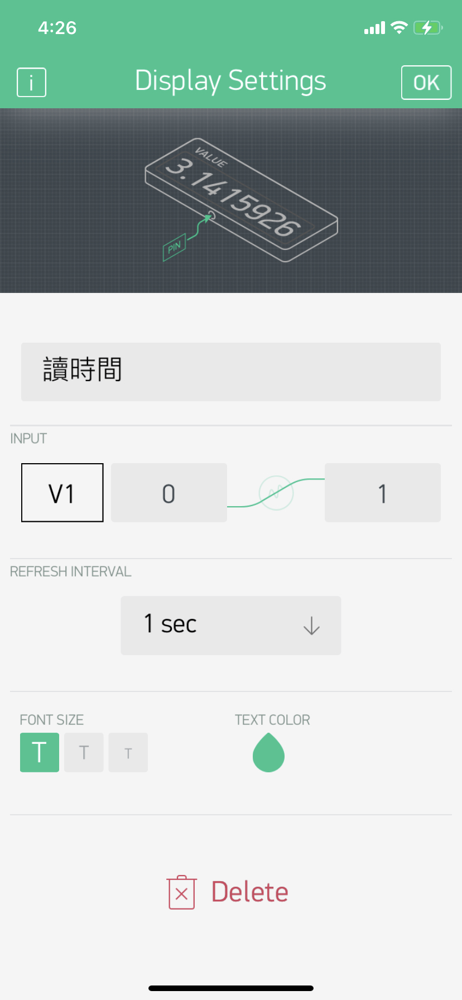

# Blynk
- 由手機Blynk App Control LED

## LEDControl
1. 手機安裝Blynk,並建立專案和取得AUTH TOKEN


2. 手機建立按鈕和做按鈕設定 
- 介面


- Button設定


- display設定


3.raspberry建立專案 for Blynk2.0

[參考網址](https://github.com/blynkkk/lib-python)

4.安裝package 
 
	sudo pip install blynklib

5.建立python檔

```
import BlynkLib
import time

#when virtual 1 pin is writted
blynk = BlynkLib.Blynk('YourAuthToken')
@blynk.VIRTUAL_WRITE(0)
def my_write_handle(value):
    print("Current V! value:{}".format(value))

#when virtual 1 pin is readed
@blynk.VIRTUAL_READ(1)
def my_read_handler():
    time.sleep(1);
    blynk.virtual_write(1,int(time.time()))

while True:
    blynk.run();
```

