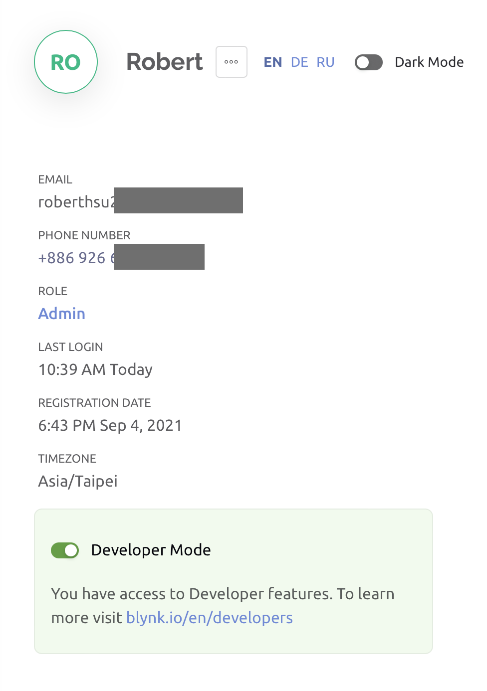
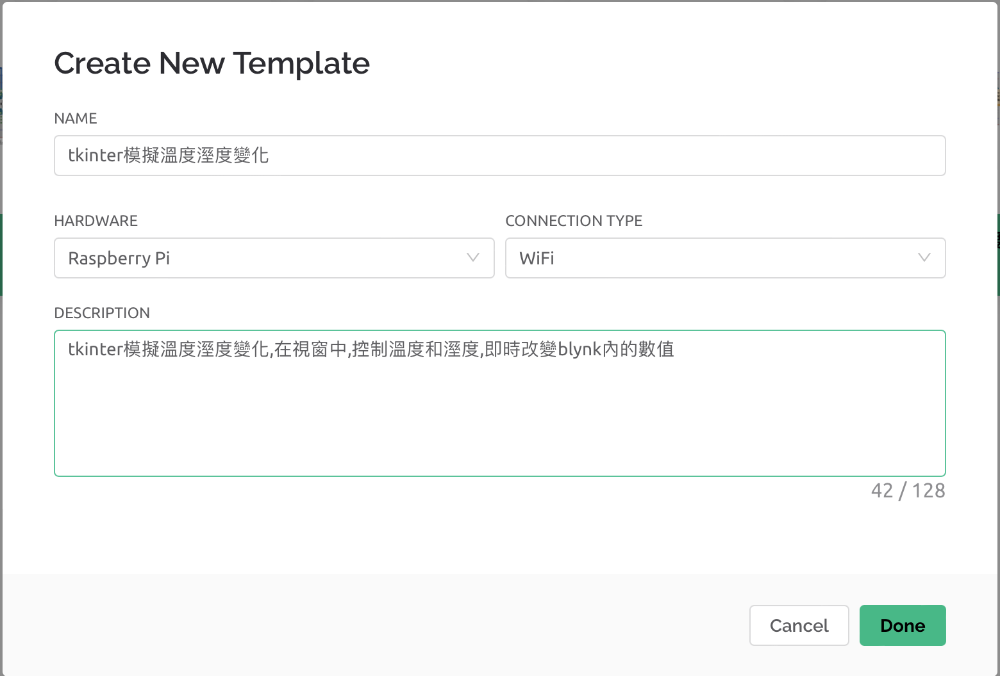
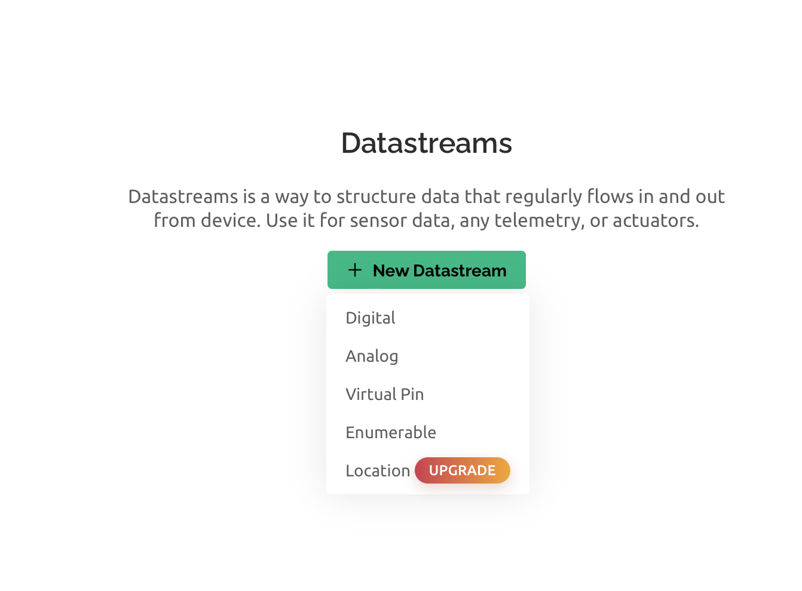
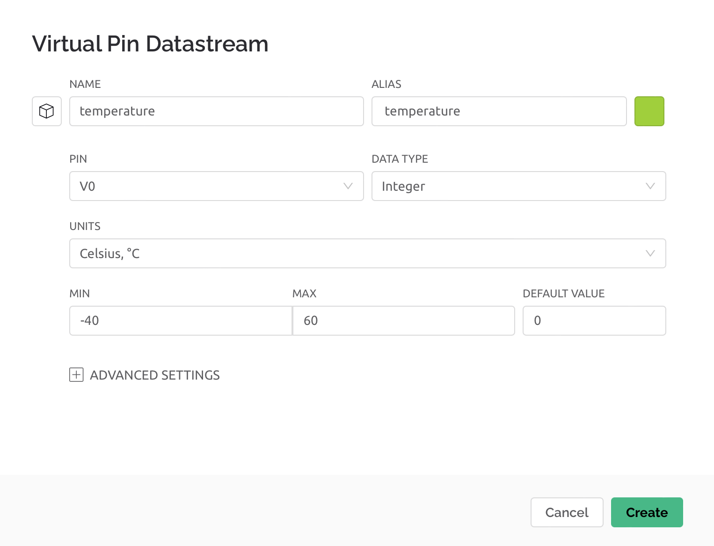
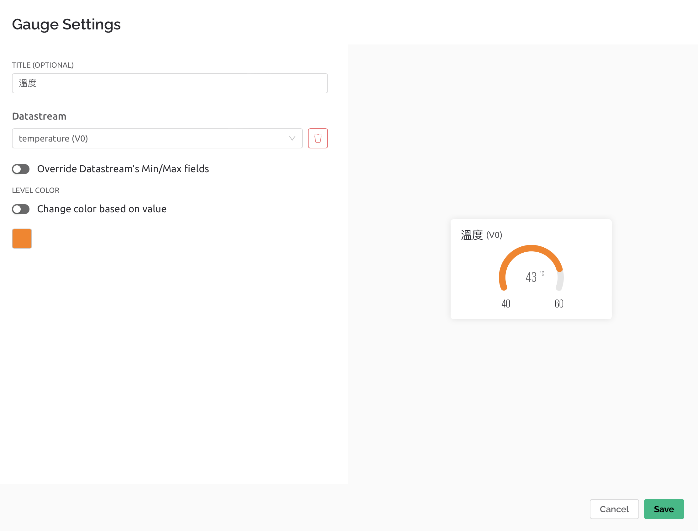
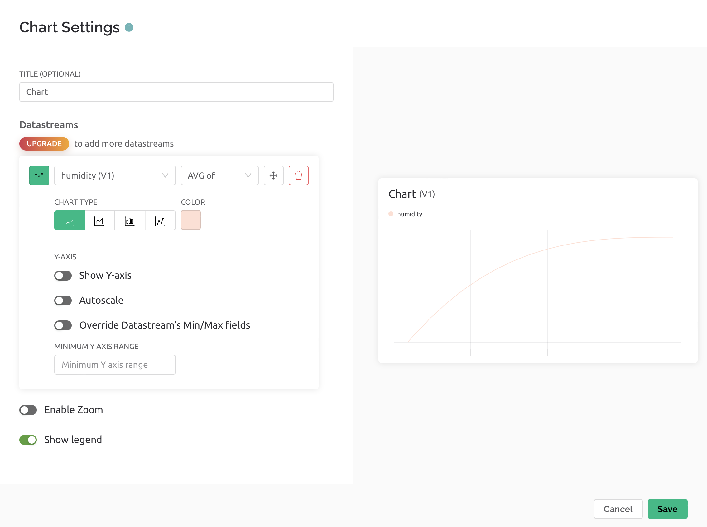
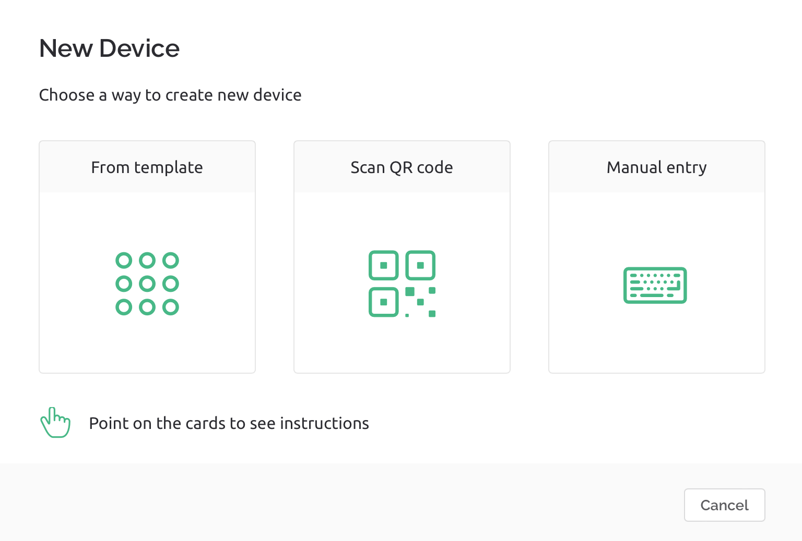
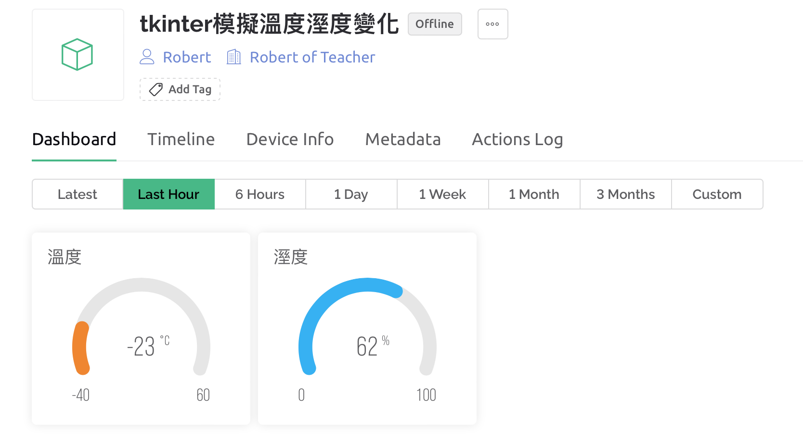
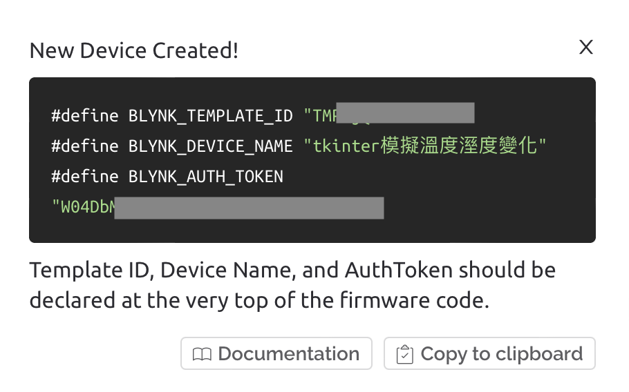
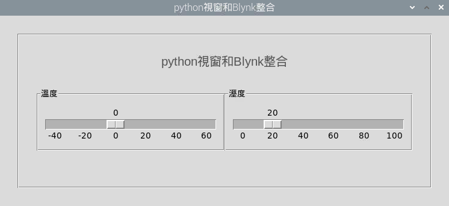

# Blynk

## WiFi provisioning目前沒有支援Raspberry 

- 官網說未來會支援

## Raspberry 支援 node.js server

## Raspberry,windows,mac支援HTTPs REST API 
- [官網說明書](https://docs.blynk.io/en/blynk.cloud/https-api-overview?_ga=2.267160334.1426463864.1656470369-1128214123.1656470369)


## 流程
####  1. 建立Blynk.cloud的帳號
#### 2. 進入user profile內,開啟Developer Mode



#### 3. 先建立New Template,建立專案名稱和硬體和照片



#### 4. 建立Datastreams,使用Virtual Pin






#### 5. Web Dashboard 建立和手機介面建立





#### 6. 建立Device(免費的只有2個,刪除原先的,建立新的)

##### 使用From Template



#### 至Device的DashBoard看更新的資料



##### 取得BLYNK_AUTH_TOKEN



##### 建立tkinter window(更新Blink內的值)



```python
updateurl = f'https://blynk.cloud/external/api/update?token={token}&v1=30'

geturl = f'https://blynk.cloud/external/api/get?token={token}&v1'

```

```python
import tkinter as tk
import requests
from tkinter import LEFT, ttk 

blynk_token = "xxxxxxxxxxxxxxxxx"


class Window(tk.Tk):
    def __init__(self):
        super().__init__()
        #-----------建立tkinter----------------------        
        self.title("python視窗和Blynk整合")
        mainFrame  = tk.Frame(self, relief="groove", borderwidth=2)
        titleFrame = tk.Frame(mainFrame)
        tk.Label(titleFrame,text="python視窗和Blynk整合",font=("Arial",15),fg="#555555").pack(padx=10)
        titleFrame.pack(pady=30)
        mainFrame.pack(pady=30,padx=30,ipadx=30,ipady=30) 

        #------------建立bottomFrame和temperatureFrame------------------------
        self._tem_job = None
        def tem_something(value):
            self._tem_job = None
            print(f"temperature={value}")
            update_url = f'https://blynk.cloud/external/api/update?token={blynk_token}&v0={value}'
            response = requests.get(update_url)
            if response.status_code == 200:
                print("溫度更新成功")


        def tem_update_value(scale_value):
            #scale_value是它的值
            if self._tem_job:
                self.after_cancel(self._tem_job)
            self._tem_job = self.after(500,lambda:tem_something(scale_value))

        bottomFrame = tk.Frame(mainFrame)
        temperatureFrame = tk.LabelFrame(bottomFrame,text="溫度")         
        self.scale = tk.Scale(temperatureFrame, orient=tk.HORIZONTAL, length=284, from_=-40, to=60,
              tickinterval=20, command=tem_update_value)
        self.scale.set(0)
        self.scale.pack(padx=10,pady=10)        

        temperatureFrame.pack(side=tk.LEFT)

        #--------------建立HumidityFrame--------------------
        self._hum_job = None
        def hum_something(value):
            self._hum_job = None
            print(f"humidity={value}")
            update_url = f'https://blynk.cloud/external/api/update?token={blynk_token}&v1={value}'
            response = requests.get(update_url)
            if response.status_code == 200:
                print("溼度更新成功")

        def hum_update_value(scale_value):
            #scale_value是它的值
            if self._hum_job:
                self.after_cancel(self._hum_job)
            self._hum_job = self.after(500,lambda:hum_something(scale_value))

        humidityFrame = tk.LabelFrame(bottomFrame,text="溼度")         
        self.humidityscale = tk.Scale(humidityFrame, orient=tk.HORIZONTAL, length=284, from_=0, to=100,
              tickinterval=20,command=hum_update_value)
        self.humidityscale.set(20)
        self.humidityscale.pack(padx=10,pady=10)
        humidityFrame.pack(side=tk.RIGHT)


        bottomFrame.pack()
        
def closeWindow():
    print("close window")
    window.destroy()

if __name__ == "__main__":
    window = Window()
    window.resizable(width=0,height=0)
    window.protocol("WM_DELETE_WINDOW",closeWindow)
    window.mainloop()


```


