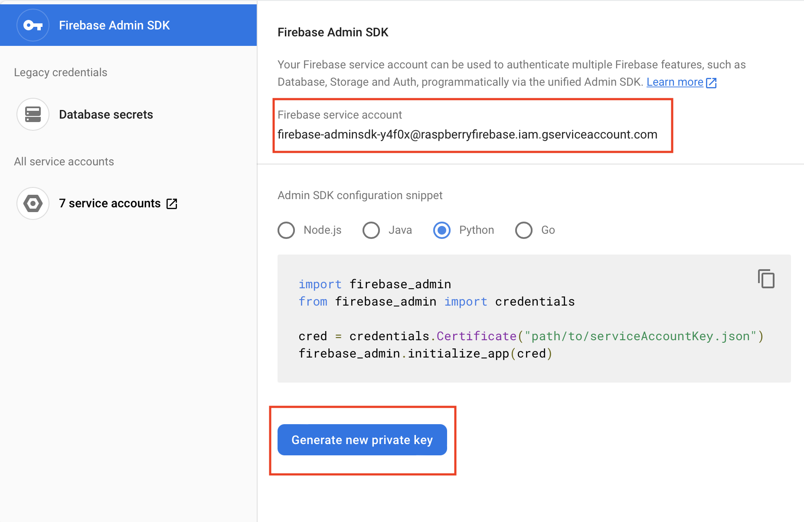
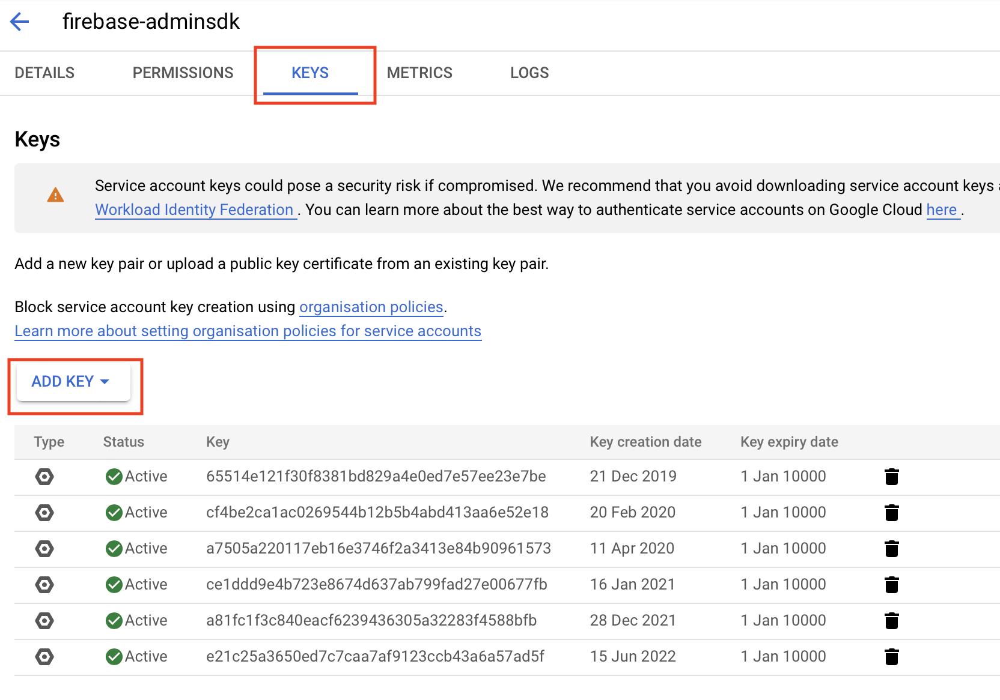
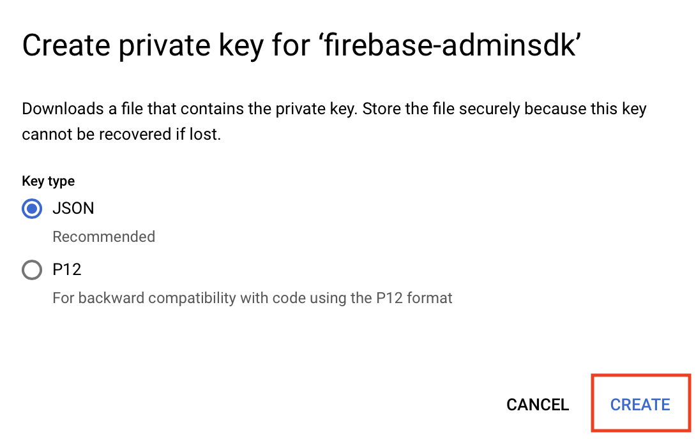

# Firebase 安裝
註冊Firebase

## 個人電腦安裝

目地:上傳web至 Firebase Hosting

安裝[Firebase CLI](https://firebase.google.com/docs/cli)

## 樹莓派上安裝firebase package

目地:提供python程式用的package

raspberry安裝[Firebase Admin](https://firebase.google.com/docs/admin/setup)

```python 
#安裝至虛擬環境
$ pip install firebase-admin
```

## 重新取得Firebase token









## RealTime_DataBase
- 要在firebase內取得json資料
- realTime database 和 python window整合
- 視窗內有註冊,當database的節點內容改變時,會即時callback


```python
import firebase_admin
from firebase_admin import credentials
from firebase_admin import db
from firebase_admin.exceptions import FirebaseError

import tkinter as tk

class Window(tk.Tk):
    def __init__(self):
        super().__init__()
        #---------------Firebase realtime database 初始化
        cred = credentials.Certificate("firebase_key/raspberryfirebase-firebase-adminsdk-y4f0x-e21c25a365.json")

        firebase_admin.initialize_app(cred, {
            'databaseURL': 'https://raspberryfirebase.firebaseio.com/'
        })

        self.ref = db.reference('raspberrypi/Radiobutton')
        

        #-----------建立tkinter----------------------

        self.radio_item_value = tk.IntVar()
        self.title("python視窗和Firebase及時資料庫")
        mainFrame  = tk.Frame(self, relief="groove", borderwidth=2)
        titleFrame = tk.Frame(mainFrame)
        tk.Label(titleFrame,text="python視窗和Firebase及時資料庫",font=("Arial",20,'bold'),fg="#555555").pack(padx=10)
        titleFrame.pack(pady=30)
        mainFrame.pack(pady=30,padx=30,ipadx=30,ipady=30)
    
        #-------------建立inputFrame-------------------
        inputFrame = tk.Frame(mainFrame,width=50)
        red=tk.Radiobutton(inputFrame, text='紅燈', value=1, variable=self.radio_item_value,command=self.getEvent,font=("Arial",15)).pack(side=tk.LEFT)
        
        green=tk.Radiobutton(inputFrame, text='綠燈', value=2, variable=self.radio_item_value,command=self.getEvent,font=("Arial",15)).pack(side=tk.LEFT)
        blue=tk.Radiobutton(inputFrame, text='藍燈', value=3, variable=self.radio_item_value,command=self.getEvent,font=("Arial",15)).pack(side=tk.LEFT)
        inputFrame.pack()

        #註冊完後,會立刻執行一次，所以放在最後面比較好
        try:
            self.ref.listen(self.colorChanged)
        except FirebaseError as e:
            print(e)

    def getEvent(self):        
        self.ref.set({
            'color':self.radio_item_value.get()
        })

    def colorChanged(self,event):
        #print(event.path)
        #print(event.data)
        self.radio_item_value.set(event.data['color'])

        


def closeWindow():
    print("close window")
    window.destroy()

if __name__ == "__main__":
    window = Window()
    window.resizable(width=0,height=0)
    window.protocol("WM_DELETE_WINDOW",closeWindow)
    window.mainloop()


```


## FireStore

```
pip install --upgrade firebase-admin

pip install google-cloud-firestore
```

### raspberry執行Firestore會有錯誤-GLIBC_2.33' not found
- 解決方法

```
#增加虛擬記憶體大小
$ sudo nano /etc/dphys-swapfile
CONF_SWAPSIZE=100 -->改為1024
#重新啟動
$sudo service dphys-swapfile restart
$htop 可以看到目前的swap


#移除
$pip uninstall grpcio 
$pip uninstall grpcio-status 

#重裝-要一些時間20~25mins
$pip install grpcio==1.44.0 --no-binary=grpcio 
$pip install grpcio-tools==1.44.0 --no-binary=grpcio-tools

#安裝完成後
#將虛擬記憶體大小改回100
```


### 大樂透選號


```python
import threading
import firebase_admin
from firebase_admin import credentials
from firebase_admin import firestore
from firebase_admin.exceptions import FirebaseError
import random
from datetime import datetime
from datetime import timezone
from datetime import timedelta
import tkinter as tk
from tkinter import ttk 


class Window(tk.Tk):
    def __init__(self):
        super().__init__()
        #---------------Firebase realtime database 初始化
        cred = credentials.Certificate("firebase_key/raspberryfirebase-firebase-adminsdk-y4f0x-e21c25a365.json")

        firebase_admin.initialize_app(cred)
        self.db = firestore.client()
        self.lotList = []
        
        

        #-----------建立tkinter----------------------        
        self.title("python視窗和FireStore資料庫")
        mainFrame  = tk.Frame(self, relief="groove", borderwidth=2)
        titleFrame = tk.Frame(mainFrame)
        tk.Label(titleFrame,text="python視窗和FireStore資料庫\n\n大樂透電腦選號",font=("Arial",15),fg="#555555").pack(padx=10)
        titleFrame.pack(pady=30)
        mainFrame.pack(pady=30,padx=30,ipadx=30,ipady=30) 
        
        #-------------建立labelFrame-------------------
        labelFrame = tk.Frame(mainFrame,width=50)        
        
        num1Label = tk.Label(labelFrame,text='00',font=("Arial",15))
        num1Label.pack(side=tk.LEFT,padx=(0,5))

        num2Label = tk.Label(labelFrame,text='00',font=("Arial",15))
        num2Label.pack(side=tk.LEFT,padx=(0,5))

        num3Label = tk.Label(labelFrame,text='00',font=("Arial",15))
        num3Label.pack(side=tk.LEFT,padx=(0,5))

        num4Label = tk.Label(labelFrame,text='00',font=("Arial",15))
        num4Label.pack(side=tk.LEFT,padx=(0,5))

        num5Label = tk.Label(labelFrame,text='00',font=("Arial",15))
        num5Label.pack(side=tk.LEFT,padx=(0,5))

        num6Label = tk.Label(labelFrame,text='00',font=("Arial",15))
        num6Label.pack(side=tk.LEFT,padx=(0,5))

        num7Label = tk.Label(labelFrame,text='00',font=("Arial",15))
        num7Label.pack(side=tk.LEFT,padx=(0,5))
        labelFrame.pack(pady=10)

        #-------------------ButtonFrame---------------------
        buttonFrame = tk.Frame(mainFrame,width=50)        
        tk.Button(buttonFrame,text="更新",padx=20,pady=10,command=lambda:self.lot_update([num1Label,num2Label,num3Label,num4Label,num5Label,num6Label,num7Label])).pack(side=tk.LEFT)

        tk.Button(buttonFrame,text="送出",padx=20,pady=10,command=self.submit).pack(side=tk.LEFT)        
        buttonFrame.pack(pady=10)

        #-----------------建立TreeView-----------------------
        columns = ['#1','#2','#3','#4','#5','#6','#7','#8']
        self.tree = ttk.Treeview(self, columns=columns, show='headings')
        self.tree.heading('#1',text='時間')
        self.tree.heading('#2',text='號碼1')
        self.tree.heading('#3',text='號碼2')
        self.tree.heading('#4',text='號碼3')
        self.tree.heading('#5',text='號碼4')
        self.tree.heading('#6',text='號碼5')
        self.tree.heading('#7',text='號碼6')
        self.tree.heading('#8',text='號碼7')
        self.tree.column('#1',width=200)
        self.tree.column('#2',width=50)
        self.tree.column('#3',width=50)
        self.tree.column('#4',width=50)
        self.tree.column('#5',width=50)
        self.tree.column('#6',width=50)
        self.tree.column('#7',width=50)
        self.tree.column('#8',width=50)
        self.tree.pack()


        #建立realtime update
        self.callback_done = threading.Event()

        ##每次只取得最新的10筆
        query_ref = self.db.collection('loto').order_by('datetime',direction=firestore.Query.DESCENDING).limit(10)       
        ##註冊callback
        col_watch = query_ref.on_snapshot(self.on_snapshot)

    def on_snapshot(self,doc_snapshot, changes, read_time):
        # 清除tree內容
        for i in self.tree.get_children():
            self.tree.delete(i) 
        #這是firestore的callback,doc_snapshot參數是list,只有10筆,順序必需相反   
        doc_snapshot.reverse()   
        for doc in doc_snapshot:
            print(doc.__class__)
            print(f'接收到的資料:{doc.id}')
            #更新treeView資料
            data_time = doc.get('datetime')
            #加8小時
            data_time = data_time + timedelta(hours=8)
            #google datetime繼承datetime.datetime
            datetime_str = data_time.strftime('%Y-%m-%d %H:%M:%S')
            nums = doc.get('lotos')
            self.tree.insert('',tk.END,values=[datetime_str] + nums)
        self.callback_done.set()


    
    def lot_update(self,labels):
        lot = set()
        while(len(lot) < 7):
            rValue = random.randint(1, 49)
            lot.add(rValue)
        self.lotList = list(lot)
        for i,num in enumerate(self.lotList):
            label = labels[i]
            label.configure(text=str(num).zfill(2))

    def submit(self):
        print(self.lotList)
        data = {
            'lotos':self.lotList,
            'datetime':datetime.now(tz=timezone(timedelta(hours=8)))
        }
        now = datetime.now()
        document_name = now.strftime('%Y-%m-%d_%H:%M:%S')
        self.db.collection('loto').document(document_name).set(data)
        
        


    
def closeWindow():
    print("close window")
    window.destroy()

if __name__ == "__main__":
    window = Window()
    window.resizable(width=0,height=0)
    window.protocol("WM_DELETE_WINDOW",closeWindow)
    window.mainloop()


```
