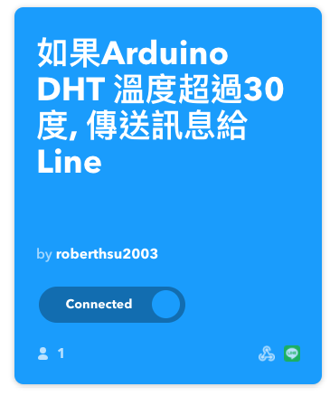
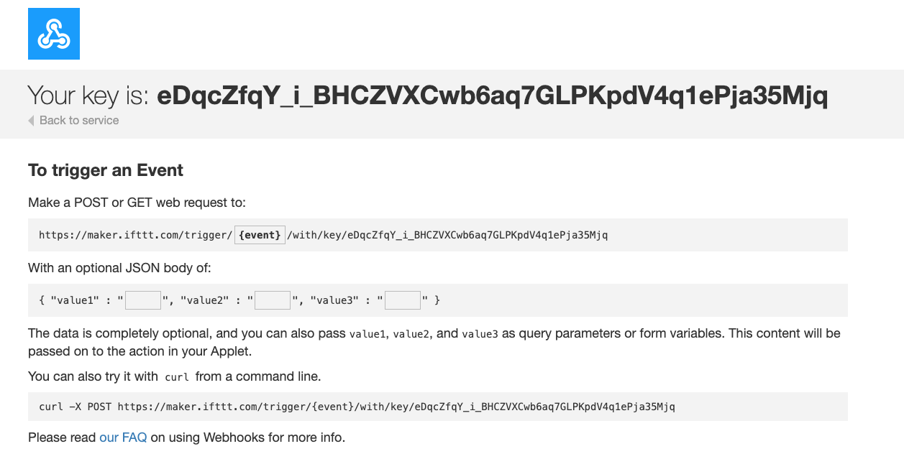

# IFTTT
## LINE
### 1 在IFTTT內建立line和webhook的連線
 


### 2 在webhook的Documents取得key



### 3 python的設定
- 安裝 Python 3 的 requests 模組

```
$ python -m pip install requests
```
	
### 4 建立python程式碼

```
import requests
import time

while True:
    my_headers = {'Content-Type':'application/json'}
    my_params={'value1':'50', 'value2':'60'}
    r = requests.get('https://maker.ifttt.com/trigger/事件名稱/with/key/你的金鑰',
                    params=my_params,
                    headers=my_headers)
    print(r.url)        
    print(r.status_code)
    time.sleep(60)

```	
	
