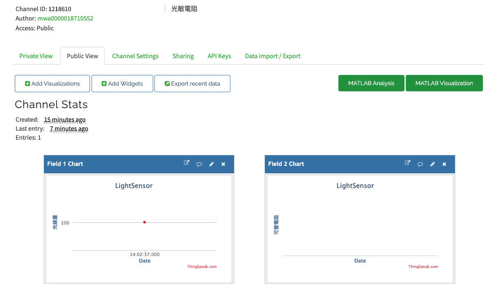
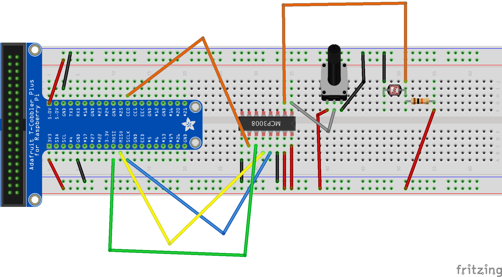
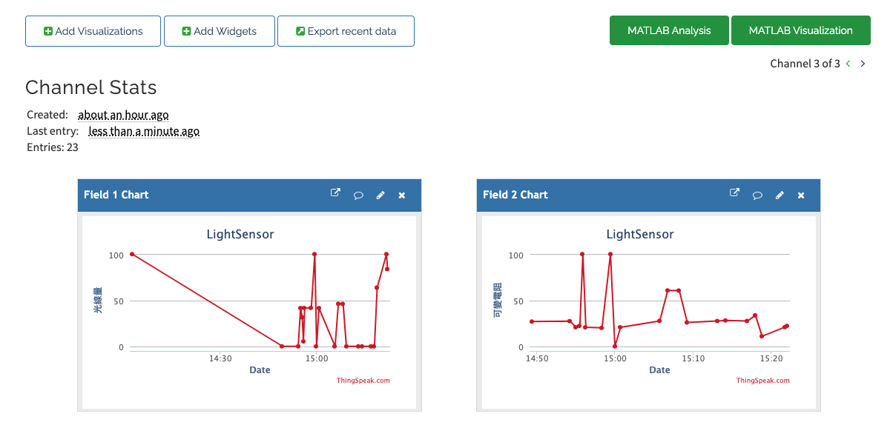

## 使用ThingSpeak web service
### [ThingSpeak Setup](https://thingspeak.com)

ThingSpeak 需要一個帳號和channel. 我們發送資料給channel,而ThingSpeak將會儲存資料. 每個channel有8個欄位包括位置欄位和狀態欄位.可以最快每15秒傳資料一次，但最佳的狀態是每一分鐘傳一次資料 

- 登入thingspeak – https://thingspeak.com/users/sign_up
- 建立一個LightSensor channel
- 建立光線量和可變電阻欄位


- 完成設定後，取得ChannelID和APIKeys

### 線路圖



```
### 程式碼(LightSensor和可變電阻)
#!/usr/bin/env python3

import sys
from gpiozero import MCP3008
import http.client, urllib
import time


pot = MCP3008()
lightSensor = MCP3008(1)
apiKey="1GKYX4BU80Y1AJH8"

def main():
    while True:
        potValue = pot.value * 100
        lightValue = lightSensor.value * 100
        parameter = urllib.parse.urlencode({'field1':"%.2f" % potValue,'field2':"%.2f" % lightValue, 'key':apiKey})
        post_to_thingSpeak(parameter)
        time.sleep(60)
        
def post_to_thingSpeak(params):
    headers = {"Content-type": "application/x-www-form-urlencoded","Accept": "text/plain"}
    not_connected = True
    while(not_connected):
        try:
            conn = http.client.HTTPConnection("api.thingspeak.com:80")
            conn.connect()
            not_connected = False
            
        except(httplib.HTTPException, socket.error) as ex:
            print("Error:%s" % ex)
        except:
            print("something wrong")
        
    conn.request("POST","/update",params, headers)
    response=conn.getresponse()
    print(response.status)
    conn.close()
        

if __name__ == "__main__":
    sys.exit(main())

```

### 讓python可以每隔1分鐘執行一次
```
#1 先設定dht22.py為可以執行檔

>>> chmod +x mcp3008.py

#2 讓電腦可以知道使用何種直譯器，dht22.py第一行程式必需加入
#!/usr/bin/env python3

#3 手動執行

./dth22.py

#4 dht22.py程式只會執行一次後就結束程序，所以這邊透過設定crontab去定時執行dht22.py程式把資料傳送到ThingSpeak上，設定的方式很簡單執行以下的指令

>>> sudo crontab -e

#5 然後加入下面這一行指令後儲存，下面的設定是每1分鐘執行一次，如果要測試可以自已修改該數值

*/1 * * * *     /home/pi/dht22.py >/dev/null 2>&1

#6 raspberry 重新啟動後還是會繼續執行，除非去刪除上面的數值
```

### 至ThingSpeak Channel看結果


### 自訂MATLAB Visualization

在channel 內自訂一個MATLAB Visualizations
- 按下new
- 選擇“Custom (no starter code)"
- 按下建立

```
readChannelID = 1213902;
fieldID1 = 1;

readAPIKey = 'KJEG9OTL9HHHPVIA';

%% Read Data %%
[data, time] = thingSpeakRead(readChannelID, 'Field', fieldID1, 'NumPoints', 10, 'ReadKey', readAPIKey);

%% Visualize Data %%
plot(time, data);
```


- 按下Run and Save
- 取得公開的網址 - https://thingspeak.com/apps/matlab_visualizations/373181


