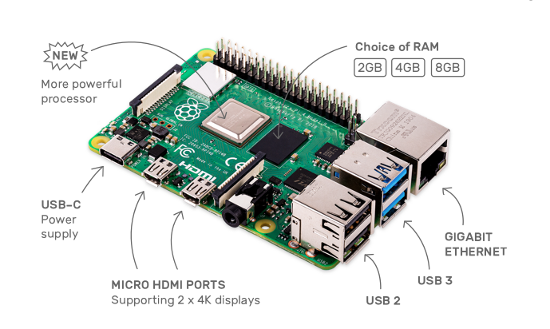
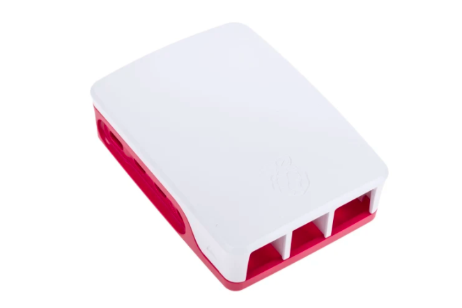
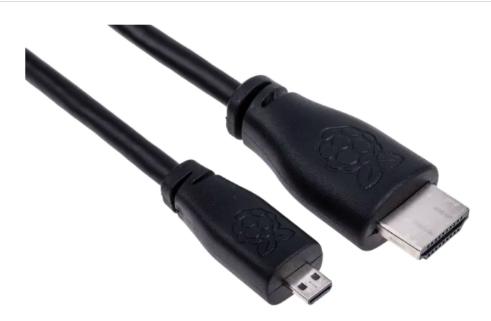

# 硬體一覽表

- ### 主要零件
- ### 樹莓派(2G,4G,8G可依自已需求選擇)

- ### 外殼(要適合樹莓派的版本,可以使用副廠)

- ### 電源線(可以使用副廠5V,2A)

- ### 螢幕線(Micro HDMI to HDMI)

- ### 週邊零件
- ### 杜邦線(公-公, 公-母)  各40條

- ### 麵包板  1個

- ### T型接頭和排線  1個

- ### LED發光二極體  10個

- ### RGB LED(共陰)  1個

- ### 電阻220歐姆  10個  

- ###v 電阻10k  3個

- ### MCP3008  1個

- ### 按鈕   3個

- ### 可變電阻3腳10k  3個

- ### LM35   1個

- ### 光敏電阻  3個

- ### SG90 9G伺服馬達  1個

- ### I2C 1602 液晶模塊  1個

- ### 蜂鳴器(有源) 1個

- ### RFID 模組套件 RC522 FID 射頻IC卡感應模塊 1個

- ### raspberry 攝影機  (副廠有200多元的)  1個

- ### 超音波 HC-SR54  1個

- ### IC 74HC595  1個

- ### 7段顯示器 0.56" 共陰  1個

- ### 5V 2路繼電器模組 1個

- ### 燈泡座和燈泡 1個

- ### AC110V 公頭帶線 SPT-1 1個

