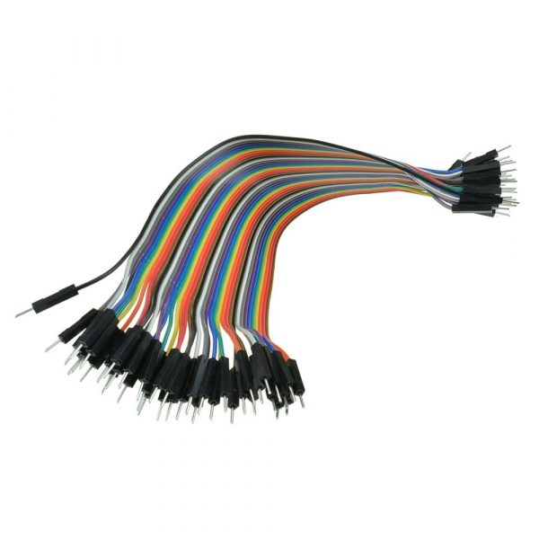
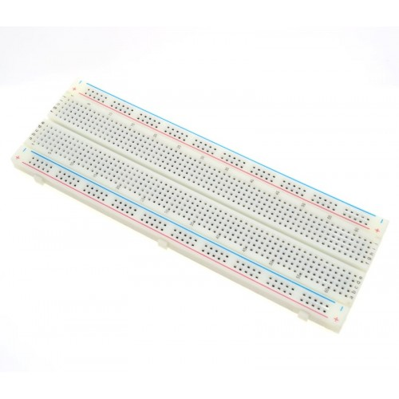
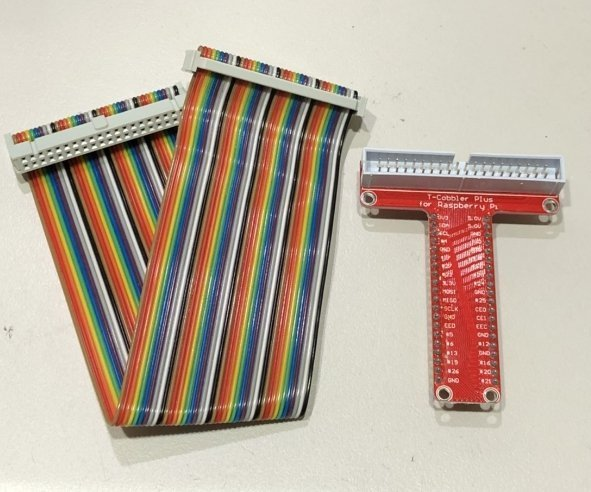
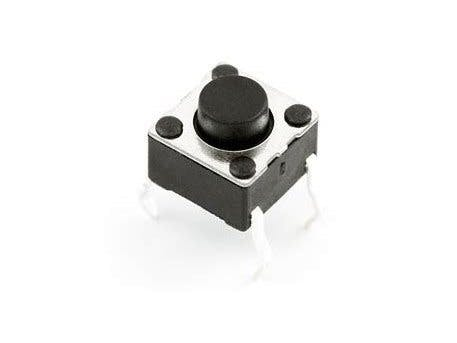
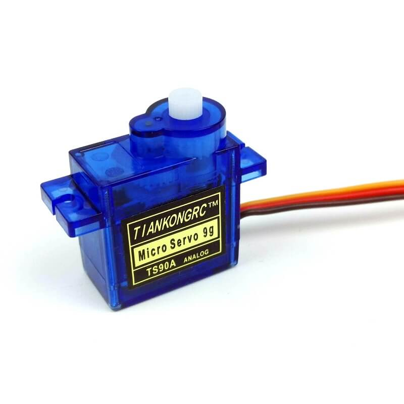
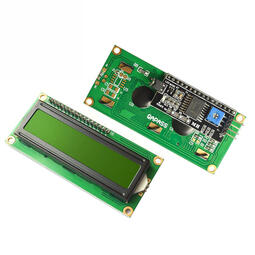
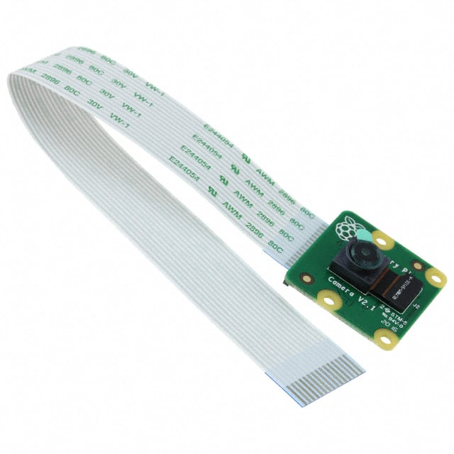
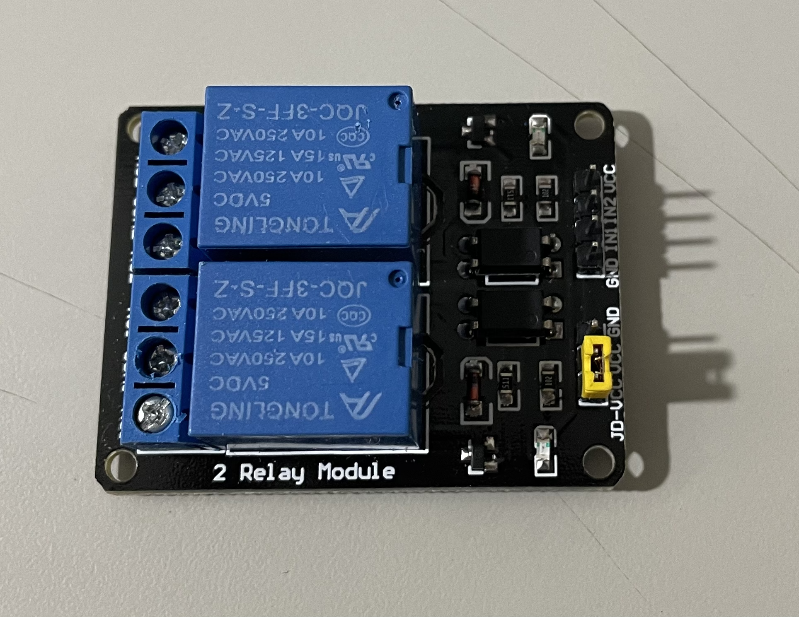

# 硬體一覽表

- ### 杜邦線(公-公, 公-母)  

- ### 麵包板  

- ### T型接頭和排線  

- ### LED發光二極體  

- ### RGB LED(共陰)  

- ### 電阻220   

- ###v 電阻10k  

- ### MCP3008  

- ### 按鈕   

- ### 可變電阻3腳10k  

- ### LM35   

- ### 光敏電阻  

- ### SG90 9G伺服馬達  

- ### I2C 1602 液晶模塊  

- ### 蜂鳴器(有源) 

- ### RFID 模組套件 RC522 FID 射頻IC卡感應模塊 

- ### raspberry 攝影機  (副廠有200多元的)  

- ### 超音波 HC-SR54

- ### IC 74HC595

- ### 7段顯示器 0.56" 共陰

- ### 5V 2路繼電器模組

- ### 燈泡座和燈泡

- ### AC110V 公頭帶線 SPT-1

